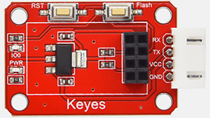
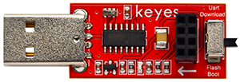
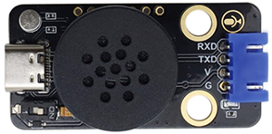

# 1. 产品概述

## 1.1 简介

**WIFI控制+语音控制扩展包**是专为UNO开发板设计的增强功能模块。添加该扩展包后，您可通过WiFi远程控制连接在UNO开发板上的LED等设备，并实时读取板载传感器数据，同步显示至控制终端。语音控制功能支持自定义唤醒词（例如“小智小智”），可通过语音指令实现开关灯等操作。本扩展包配套课程，专门适配KE3001、KE3002、KE3003三款传感器套件，提供针对性的教学与实践指导。

## 1.2 清单

| 序号 | 名称                                                         | 数量 | 图片                                   |
| ---- | ------------------------------------------------------------ | ---- | -------------------------------------- |
| 1    | Keyes STEM电子积木 SU03小智中文语音模块                      | 1    |  |
| 2    | keyes brick ESP-01S Arduino wifi转串口扩展板(焊盘孔) 防反插白色端子 | 1    |  |
| 3    | Keyes USB转ESP-01S WIFI模块串口测试扩展板                    | 1    |  |

## 1.3 模块介绍

**1.语音模块介绍**

小智语音模块，使用MUS516P6为主控芯片，是一款低功耗、小体积、功能强大的离线语音识别模组，能快速应用于智能家居，各类智能小家电，86 盒，玩具，灯具等需要语音操控的产品。

