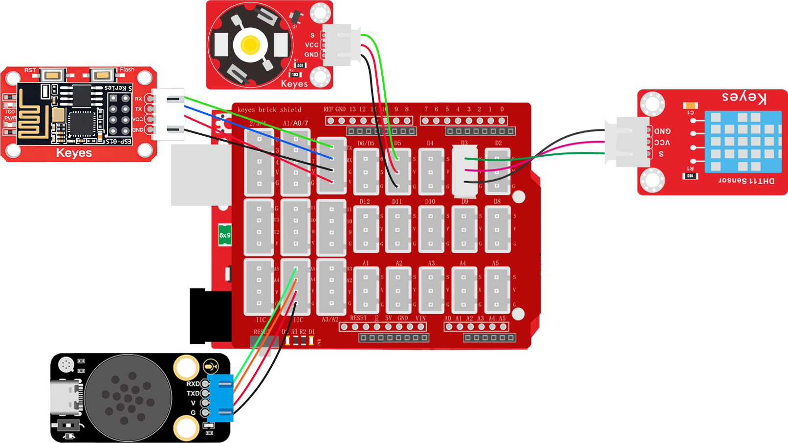
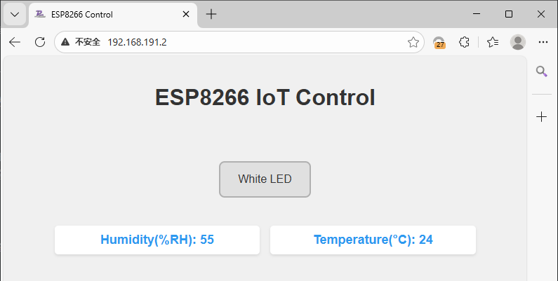

# 2.4.4 智能孵蛋系统

## 2.4.4.1 简介 

了解到正常可孵化的鸡蛋需要满足以下基础条件才能孵化，第一个是温度再37.5℃~37.8℃，第二个是湿度保持再50%-60%之间。知道了条件我们就能利用我们手中的DHT11对环境中的温度与湿度进行检测，而温度的更改则交给3W的白光灯（这里我们是做模拟）因为大功率的灯光是会发热的，我们使用WiFi模块进行远程传输温度与湿度数据方便实时查看以及控制灯光打开加温熄灭降温操作，使用语音模块进行语音控制播报当前温度与湿度。

## 2.4.4.2 接线图

<span style="color:red;">注意：UNO代码上传完毕后再将ESP-01S模块连接到UNO扩展板上，连接时注意ESP-01S模块接口的线序，GND对应黑色线，VCC对应红色线，不要接错！！！</span>



## 2.4.4.3 ESP01-S 代码

<span style="color:red;">请注意，你需要将SSID 名称与PASSWD 密码修改成你需要连接的WiFi的，并且这个WiFi需要是2.4GHz频段的。</span>

```c
#include <ESP01_Wed.h>

char* WiFi_SSID = "LiuTest";       //你的wifi名称
char* WiFi_Password = "88888888";  //你的wifi密码

// 创建库对象
ESP01_Wed webInterface(WiFi_SSID, WiFi_Password, 750);  // SSID, 密码, 串口波特率

void setup() {
  // 初始化库
  webInterface.begin();

  // 添加传感器显示，将不需要显示的直接注释掉对应的代码即可
  //   webInterface.addSensor("Water Detect", "water", "waterValue");              //水滴传感器数据显示
     webInterface.addSensor("Temperature(&deg;C)", "temperature", "tempValue");  //温度数据显示
     webInterface.addSensor("Humidity(%RH)", "humidity", "humidityValue");       //湿度数据显示
  //   webInterface.addSensor("LIGHT", "light", "lightValue");                     //光敏传感器数据显示
  //   webInterface.addSensor("Ultrasonic(cm)", "ultrasonic", "ultraValue");       //超声波距离数据显示
  //   webInterface.addSensor("Smoke", "smoke", "smokeValue");                     //烟雾传感器数据显示
  //   webInterface.addSensor("Alcohol", "alcohol", "alcoholValue");               //酒精传感器数据显示
  //   webInterface.addSensor("Soil Moisture", "soil", "soilValue");               //土壤湿度传感器数据显示
  //   webInterface.addSensor("Pot", "pot", "potValue");                           //电位器数据显示器

  // 添加控制按钮，将不需要的按键直接注释掉对应的代码即可
//  webInterface.addToggleButton("Red LED", "RED_LED:1", "RED_LED:0");        //添加红光灯控制按键
//   webInterface.addToggleButton("Green LED", "GREEN_LED:1", "GREEN_LED:0");  //添加绿光灯控制按键
//   webInterface.addToggleButton("Blue LED", "BLUE_LED:1", "BLUE_LED:0");     //添加蓝光灯控制按键
   webInterface.addToggleButton("White LED", "WHITE_LED:1", "WHITE_LED:0");  //添加白光灯控制按键
//   webInterface.addToggleButton("Relay", "RELAY:1", "RELAY:0");              //添加继电器模块控制按键
//   webInterface.addToggleButton("Laser", "LASER:1", "LASER:0");              //添加激光模块控制按键
//   webInterface.addToggleButton("Water Pump", "PUMP:1", "PUMP:0");           //添加水泵控制按键
//   webInterface.addToggleButton("Motor", "MOTOR:1", "MOTOR:0");              //添加电机控制按键
//   webInterface.addToggleButton("Servo", "SERVO:1", "SERVO:0");              //添加舵机控制按键

  // 打印IP地址
  Serial.print("Web server IP: ");
  Serial.println(webInterface.getIP());
}

void loop() {
  // 主循环
  webInterface.loop();
}
```


## 2.4.4.4 UNO 代码

```c
// 引入SoftwareSerial库，用于创建软串口通信
#include <SoftwareSerial.h>
#include <dht11.h>

//创建DHT11对象
dht11 DHT;
#define DHT11_PIN 3  //定义DHT11为数子口3

// 创建软串口对象，使用A5作为RX引脚接收数据，A4作为TX引脚发送数据
SoftwareSerial mySerial(A5, A4);

// 定义变量用于存储从语音模块接收到的控制码
volatile int Voice_Control = 0;  // 初始化为0，确保首次判断时不触发任何指令

// 用于存储从串口接收到的控制指令字符串
String WiFi_Control = "";

// 定义连接的引脚号
int LEDPin = 5;


/*
 函数功能：通过串口发送具有固定帧格式的数据包
 数据包格式：帧头(0xAA 0x55) + 消息号数据 + 数据1 + 数据2 + 帧尾(0x55 0xAA)
 
 输入参数说明：
  ---Message_Number ：消息号，用于标识命令类型   <必需填写>
  ---data1 ：第一个数据参数  <如果没有数据就输入0>
  ---data2 ：第二个数据参数  <如果没有数据就输入0>
 */
void Uart_SendCmd(int Message_Number, int data1, int data2) {
  // 发送帧头：固定字节0xAA和0x55，用于标识数据包的开始
  mySerial.write(0XAA);
  mySerial.write(0X55);

  // 发送消息号，标识具体的命令类型
  mySerial.write(Message_Number);

  // 发送两个数据参数
  mySerial.write(data1);
  mySerial.write(data2);

  // 发送帧尾：固定字节0x55和0xAA，用于标识数据包的结束
  mySerial.write(0X55);
  mySerial.write(0XAA);
}

void dht11_chk() {
  int chk;
  chk = DHT.read(DHT11_PIN);  // READ DATA
  switch (chk) {
    case DHTLIB_OK:
      break;
    case DHTLIB_ERROR_CHECKSUM:  //校检和错误返回
      break;
    case DHTLIB_ERROR_TIMEOUT:  //超时错误返回
      break;
    default:
      break;
  }
}

void setup() {
  // 初始化串口通信，波特率设置为750（注意：非标准波特率，需确保通信双方一致）
  Serial.begin(750);
  // 初始化软串口，用于与语音模块通信，波特率9600
  mySerial.begin(9600);

  // 将引脚设置为输入模式
  pinMode(DHT11_PIN, INPUT);
  // 将LED引脚设置为输出模式
  pinMode(LEDPin, OUTPUT);
}

void loop() {
  //检查DHT11数据是否正常
  dht11_chk();
  //读取传感器数据
  int TempValue = DHT.temperature;
  int HumValue = DHT.humidity;

  // 检查串口是否有数据可读
  if (Serial.available()) {
    // 读取直到换行符('\n')的数据，并转换为String类型
    WiFi_Control = Serial.readStringUntil('\n');

    // 去除字符串首尾的空白字符（如回车、空格等）
    WiFi_Control.trim();
    //发送传感器数据到ESP01-S模块，给网页显示
    if (WiFi_Control == "SENSOR_READ") {
      Serial.println("TEMP:" + String(TempValue));
      Serial.println("HUM:" + String(HumValue));
    }
  }
  // 持续检查软串口是否有来自语音模块的数据
  while (mySerial.available()) {
    // 读取一个字节的数据
    Voice_Control = mySerial.read();

    // 将接收到的数据通过硬件串口输出，便于调试和监控
    Serial.println(Voice_Control);
  }

  if (Voice_Control == 3 || WiFi_Control == "WHITE_LED:1") {
    digitalWrite(LEDPin, HIGH);
    Serial.println("ACK:WHITE_LED:1");

  } else if (Voice_Control == 4 || WiFi_Control == "WHITE_LED:0") {
    digitalWrite(LEDPin, LOW);
    Serial.println("ACK:WHITE_LED:0");

  } else if (Voice_Control == 25) {
    // 指令码为25时发送消息号2，data1为温度值，data2为0
    Uart_SendCmd(2, TempValue, 0);

  } else if (Voice_Control == 26) {
    // 指令码为26时发送消息号3，data1为湿度值，data2为0
    Uart_SendCmd(3, HumValue, 0);
  }
  // 清除指令字符串，避免重复执行
  WiFi_Control = "";
  Voice_Control = 0;
}

```


## 2.4.4.5 UNO 代码说明

① 添加库文件，设置模拟串口引脚为RX：A5，TX：A4，设置接收数据变量，添加全局变量整数类型名为`Voice_Control`，添加全局变量字符串类型名为`WiFi_Control`，设置DHT11与LED控制引脚

② 搭建语音发送数据函数`Uart_SendCmd`，搭建DHT11数据检验函数`dht11_chk`

③ 设置好串口波特率为`750`，模拟串口波特率为`9600`，引脚输入与输出

④ 判断语音模块是否通过模拟串口发送控制数据过来如果有就将控制数据赋值给变量`Voice_Control`

⑤ 判断WiFi模块是否通过串口发送控制数据过来，如果有就将控制数据赋值给变量给变量`WiFi_Control`，判断变量`WiFi_Control`中的数据是否等于`SENSOR_READ`指令，如果是就依次使用串口打印模块发送数据。

⑥ 使用逻辑或对语音控制模块的控制指令和wifi控制模块的指令进行判断，只要有一个条件满足就执行相应的功能代码（注意：每个WiFi控制的功能代码都要做一个应答否则将无法实现控制效果）

## 2.4.4.6 代码结果

上传代码成功后，等待WiFi连接成功你将可以通过浏览器输入ESP01-S的IP地址进入控制页面，页面中实时显示温度与湿度并且还能控制3W LED等的亮灭。

语音模块控制示例：

**播报温度示例：** 你：“小智小智” ，小智：“我在”，你：“当前温度” 或 “现在温度是多少” ，小智：“当前温度是"温度值"摄氏度”

**播报湿度示例：** 你：“小智小智” ，小智：“我在”，你：“当前湿度” 或 “现在湿度是多少” ，小智：“当前湿度是百分之"湿度值"”

**打开3W LED示例：** 你：“小智小智” ，小智：“我在”，你：“开白灯” 或 “开灯” 或 “打开客厅灯”，小智：“已打开”

**关闭3W LED示例：** 你：“小智小智” ，小智：“我在”，你：“关白灯” 或 “关灯” 或 “关闭客厅灯”，小智：“已关闭”

