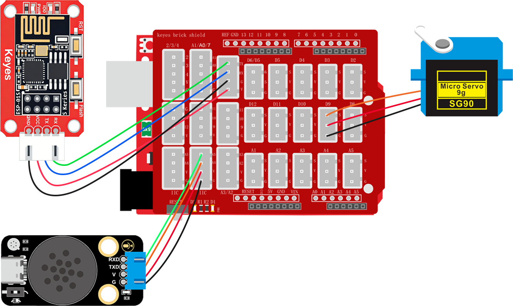

### 2.6.11 智能窗户控制

**1. 简介**

当你不想起身去关窗时你是不是在想喊一声通过语音控制或者通过手机控制窗户的开关。本次课程就是教你如何使用ESP-01S模块加语音模块控制舵机模拟出开关窗的动作。

**2. 控制指令表**

命令参数表：

| 命令码 |     命令词     | 命令回复 |
| :----: | :------------: | :------: |
|   17   | 打开舵机，开窗 |  已打开  |
|   18   | 关闭舵机，关窗 |  已关闭  |

**3. 接线图**

<span style="color:red;">注意：UNO代码上传完毕后再将ESP-01S模块连接到UNO扩展板上，连接时注意ESP-01S模块接口的线序，GND对应黑色线，VCC对应红色线，不要接错！！！</span>



**4. ESP-01S 代码**

<span style="color:red;">请注意，你需要将SSID 名称与PASSWD 密码修改成你需要连接的WiFi的，并且这个WiFi需要是2.4GHz频段的。</span>

```c
#include <ESP01_Wed.h>

char* WiFi_SSID = "LiuTest";       //你的wifi名称
char* WiFi_Password = "88888888";  //你的wifi密码

// 创建库对象
ESP01_Wed webInterface(WiFi_SSID, WiFi_Password, 750);  // SSID, 密码, 串口波特率

void setup() {
  // 初始化库
  webInterface.begin();

  // 添加传感器显示，将不需要显示的直接注释掉对应的代码即可
  //   webInterface.addSensor("Water Detect", "water", "waterValue");              //水滴传感器数据显示
  //   webInterface.addSensor("Temperature(&deg;C)", "temperature", "tempValue");  //温度数据显示
  //   webInterface.addSensor("Humidity(%RH)", "humidity", "humidityValue");       //湿度数据显示
  //   webInterface.addSensor("LIGHT", "light", "lightValue");                     //光敏传感器数据显示
  //   webInterface.addSensor("Ultrasonic(cm)", "ultrasonic", "ultraValue");       //超声波距离数据显示
  //   webInterface.addSensor("Smoke", "smoke", "smokeValue");                     //烟雾传感器数据显示
  //   webInterface.addSensor("Alcohol", "alcohol", "alcoholValue");               //酒精传感器数据显示
  //   webInterface.addSensor("Soil Moisture", "soil", "soilValue");               //土壤湿度传感器数据显示
  //   webInterface.addSensor("Pot", "pot", "potValue");                           //电位器数据显示器

  // 添加控制按钮，将不需要的按键直接注释掉对应的代码即可
//  webInterface.addToggleButton("Red LED", "RED_LED:1", "RED_LED:0");        //添加红光灯控制按键
//   webInterface.addToggleButton("Green LED", "GREEN_LED:1", "GREEN_LED:0");  //添加绿光灯控制按键
//   webInterface.addToggleButton("Blue LED", "BLUE_LED:1", "BLUE_LED:0");     //添加蓝光灯控制按键
//   webInterface.addToggleButton("White LED", "WHITE_LED:1", "WHITE_LED:0");  //添加白光灯控制按键
//   webInterface.addToggleButton("Relay", "RELAY:1", "RELAY:0");              //添加继电器模块控制按键
//   webInterface.addToggleButton("Laser", "LASER:1", "LASER:0");              //添加激光模块控制按键
//   webInterface.addToggleButton("Water Pump", "PUMP:1", "PUMP:0");           //添加水泵控制按键
//   webInterface.addToggleButton("Motor", "MOTOR:1", "MOTOR:0");              //添加电机控制按键
   webInterface.addToggleButton("Servo", "SERVO:1", "SERVO:0");              //添加舵机控制按键

  // 打印IP地址
  Serial.print("Web server IP: ");
  Serial.println(webInterface.getIP());
}

void loop() {
  // 主循环
  webInterface.loop();
}
```

**5. UNO代码**

```c
// 引入SoftwareSerial库，用于创建软串口通信
#include <SoftwareSerial.h>
#include <Servo.h>  //舵机库
Servo myservo;

// 创建软串口对象，使用A5作为RX引脚接收数据，A4作为TX引脚发送数据
SoftwareSerial mySerial(A5, A4);

// 定义变量用于存储从语音模块接收到的控制码
volatile int Voice_Control = 0;  // 初始化为0，确保首次判断时不触发任何指令

// 用于存储从串口接收到的控制指令字符串
String WiFi_Control = "";

// 定义舵机连接的引脚号
int servoPin = 9;


void setup() {
  // 初始化串口通信，波特率设置为750（注意：非标准波特率，需确保通信双方一致）
  Serial.begin(750);
  // 初始化软串口，用于与语音模块通信，波特率9600
  mySerial.begin(9600);
  myservo.attach(servoPin);  //舵机连接数字口9
    //舵机旋转到180度
  myservo.write(180);
}

void loop() {
  // 检查串口是否有数据可读
  if (Serial.available()) {
    // 读取直到换行符('\n')的数据，并转换为String类型
    WiFi_Control = Serial.readStringUntil('\n');

    // 去除字符串首尾的空白字符（如回车、空格等）
    WiFi_Control.trim();

    // 将接收到的指令回传到串口，便于调试
    Serial.print("WiFi_Control:");
    Serial.println(WiFi_Control);
  }
  // 持续检查软串口是否有来自语音模块的数据
  while (mySerial.available()) {
    // 读取一个字节的数据
    Voice_Control = mySerial.read();

    // 将接收到的数据通过硬件串口输出，便于调试和监控
    Serial.println(Voice_Control);
  }

  // 判断接收到的指令内容并执行相应操作
  if ((WiFi_Control == "SERVO:1") || (Voice_Control == 17)) {
    //舵机旋转到180度
    myservo.write(180);
    // 发送应答指令到串口
    Serial.println("ACK:SERVO:1");

  } else if ((WiFi_Control == "SERVO:0") || (Voice_Control == 18)) {
    //舵机旋转到0度
    myservo.write(0);
    // 发送应答指令到串口
    Serial.println("ACK:SERVO:0");
  }
  // 清除指令字符串，避免重复执行
  WiFi_Control = "";
  Voice_Control = 0;
}
```

**6. 代码说明**

① 添加库文件，设置模拟串口引脚为RX：A5，TX：A4，添加全局变量整数类型名为`Voice_Control`，添加全局变量字符串类型名为`WiFi_Control`，设置舵机模块控制引脚

② 设置好模拟串口波特率为`9600`以及串口波特率`750`，初始化舵机到180度表示窗户为打开状态。

③ 读取模拟串口中语言模块发送的控制指令，并赋值给变量`Voice_Control`； 读取串口中ESP-01S模块发送的控制指令，并赋值给变量`WiFi_Control`

④ 使用判断模块判断变量`Voice_Control`等于`17`或者变量`WiFi_Control`等于`SERVO:1`，如果条件满足舵机旋转到180度（开窗），串口打印"ACK:SERVO:1"应答。

④ 添加否则如果判断变量`Voice_Control`等于`18`或者变量`WiFi_Control`等于`SERVO:0`，如果条件满足舵机旋转到0度（关窗），串口打印"ACK:SERVO:0"应答。

**7. 代码结果**

上传测试代码成功，你可以通过WiFi输入IP地址进入控制页面控制舵机旋转并且你也可以使用语言模块控制舵机打开以及关闭。

语言模块控制方法：

**开窗示例：** 你：“小智小智” ，小智：“我在”，你：“开窗” 或 “打开舵机” ，小智：“已打开”。

**关窗示例：** 你：“小智小智” ，小智：“我在”，你：“关窗” 或 “关闭舵机” ，小智：“已关闭”。
