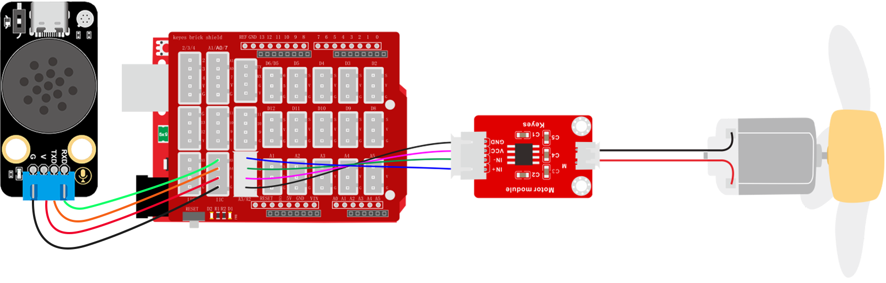

#    2.6.12 智能语音风扇

## 2.6.12.1 简介

如今市面上有很多的语音控制风扇，再也不像以前需要手动去调节风扇了，你只需要对着它喊出它的名称并告诉它你要它执行的命令就可以了，比如开风扇关风扇，一档，二档，三档等操作。本次课程我们就是基于语音模块做一个语音控制风扇模块的实验。

## 2.6.12.2 控制指令表

**命令参数表：**

| 命令码 |         命令词         |    命令回复    |
| :----: | :--------------------: | :------------: |
|   19   |        打开风扇        |   风扇已打开   |
|   20   | 风扇调到一档，风扇一档 | 风扇已调到一档 |
|   21   | 风扇调到二档，风扇二档 | 风扇已调到二档 |
|   22   | 风扇调到三档，风扇三档 | 风扇已调到三档 |
|   23   |        关闭风扇        |   风扇已关闭   |

## 2.6.12.3 接线图



## 2.6.12.4 代码

```c
// 引入SoftwareSerial库，用于创建软串口通信（模拟串口，可使用任意数字/模拟引脚）
#include <SoftwareSerial.h>

// 引入SoftPWM库，用于软件模拟PWM输出（适用于不支持硬件PWM的引脚）
#include <SoftPWM.h>

// 创建软串口对象，使用A5作为RX引脚接收数据，A4作为TX引脚发送数据
// 通常用于与语音模块进行串口通信
SoftwareSerial mySerial(A5, A4);

// 定义变量用于存储从语音模块接收到的控制码
volatile int Voice_Control = 0;  // 初始化为0，确保首次判断时不触发任何指令

// 定义直流电机控制引脚
int IN_Pin = A3;  // 电机方向控制引脚
int EN_Pin = A2;  // 电机使能/PWM调速引脚

// 注意：以下setup()中使用了未声明的变量 myservo 和 servoPin，以及未初始化的SoftPWM库
void setup() {
  // 初始化硬件串口，波特率750（非标准值，需确保通信双方一致）
  Serial.begin(750);

  // 初始化软串口，用于与语音模块通信，波特率9600（标准值）
  mySerial.begin(9600);

  //配置模拟PWM
  SoftPWMBegin();
  SoftPWMSet(EN_Pin, 0);
  SoftPWMSetFadeTime(EN_Pin, 1000, 1000);
}

void loop() {
  // 持续检查软串口缓冲区是否有来自语音模块的数据
  while (mySerial.available()) {
    // 读取一个字节的数据（通常语音模块发送的是ASCII字符或字节值）
    Voice_Control = mySerial.read();
    // 将接收到的原始数据通过硬件串口打印到串口监视器，便于调试
    Serial.println(Voice_Control);
  }

  // 根据接收到的指令值（Voice_Control）执行电机控制
  if (Voice_Control == 19) {         // 指令19：最高速正转
    SoftPWMSet(EN_Pin, 255);         // 设置PWM占空比为255（最大速度）
    digitalWrite(IN_Pin, LOW);       // 设置方向引脚为低电平（假设低电平为正转）
  } else if (Voice_Control == 20) {  // 指令20：中低速正转（100/255 ≈ 39%）
    SoftPWMSet(EN_Pin, 100);
    digitalWrite(IN_Pin, LOW);
  } else if (Voice_Control == 21) {  // 指令21：中高速正转（175/255 ≈ 69%）
    SoftPWMSet(EN_Pin, 175);
    digitalWrite(IN_Pin, LOW);
  } else if (Voice_Control == 22) {  // 指令22：最高速正转
    SoftPWMSet(EN_Pin, 255);
    digitalWrite(IN_Pin, LOW);
  } else if (Voice_Control == 23) {  // 指令23：停止（PWM设为0）
    SoftPWMSet(EN_Pin, 0);
    digitalWrite(IN_Pin, LOW);
  }

  // 清除指令字符串，避免重复执行
  Voice_Control = 0;
}
```


## 2.6.12.5 代码说明

① 添加库文件，设置模拟串口引脚为RX：A5，TX：A4，设置全局变量`Voice_Control`用于存放语模块发送过来的命令码，设置控制电机引脚

② 设置串口波特率为`750`以及模拟串口的波特率为`9600`，配置模拟PWM代码

③ 搭建接收命令码代码并将命令码复制给变量`Voice_Control`

④ 对变量`Voice_Control`进行判断等于`19`为打开风扇，等于`20`为风扇一档，等于`21`为风扇二档，等于`22`为风扇三档，等于`23`为关闭风扇，因为我们需要对电机的转速进行控制，所有我们使用到了一个软件模拟输出的代码块，这个代码块是可以给没有PWM输出功能的引脚输出模拟PWM信号达到控制效果。

## 2.6.12.6 代码结果

上传代码成功后，使用唤醒词“小智小智”唤醒小智语音模块，他会回答你“我在”然后你就可以使用命令词进行控制它了，如当前教程，我们就可以这样

**打开风扇示例：** 你：“小智小智” ，小智：“我在”，你：“打开风扇” ，小智：“风扇已打开”

**风扇一档示例：** 你：“小智小智” ，小智：“我在”，你：“风扇调到一档” 或 “风扇一档” ，小智：“风扇已调到一档”

**风扇二档示例：** 你：“小智小智” ，小智：“我在”，你：“风扇调到二档” 或 “风扇二档” ，小智：“风扇已调到二档”

**风扇三档示例：** 你：“小智小智” ，小智：“我在”，你：“风扇调到三档” 或 “风扇三档” ，小智：“风扇已调到三档”

**关闭风扇示例：** 你：“小智小智” ，小智：“我在”，你：“关闭风扇”，小智：“风扇已关闭”