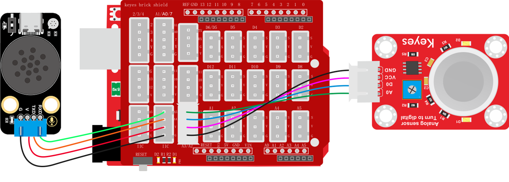

# 2.6.3 烟雾报警器

## 2.6.3.1 简介

当烟雾传感器检测到烟雾时，语音模块就会发出警告提示音“警告，检测到烟雾，请快速撤离”。

## 2.6.3.2 控制指令表

**消息号表：**

| 消息号 |           播报语音           |
| :----: | :--------------------------: |
|   11   | 警告，检测到烟雾，请快速撤离 |

## 2.6.3.3 接线图



## 2.6.3.4 代码

```c
// 引入SoftwareSerial库，用于创建软串口通信
#include <SoftwareSerial.h>

// 创建软串口对象，使用A5作为RX引脚接收数据，A4作为TX引脚发送数据
SoftwareSerial mySerial(A5, A4);

// 定义变量用于存储从语音模块接收到的控制码
volatile int Voice_Control = 0;  // 初始化为0，确保首次判断时不触发任何指令

// 定义传感器连接的引脚号
int SensorPin = A2;

/*
 函数功能：通过串口发送具有固定帧格式的数据包
 数据包格式：帧头(0xAA 0x55) + 消息号数据 + 数据1 + 数据2 + 帧尾(0x55 0xAA)
 
 输入参数说明：
  ---Message_Number ：消息号，用于标识命令类型   <必需填写>
  ---data1 ：第一个数据参数  <如果没有数据就输入0>
  ---data2 ：第二个数据参数  <如果没有数据就输入0>
 */
void Uart_SendCmd(int Message_Number, int data1, int data2) {
  // 发送帧头：固定字节0xAA和0x55，用于标识数据包的开始
  mySerial.write(0XAA);
  mySerial.write(0X55);

  // 发送消息号，标识具体的命令类型
  mySerial.write(Message_Number);

  // 发送两个数据参数
  mySerial.write(data1);
  mySerial.write(data2);

  // 发送帧尾：固定字节0x55和0xAA，用于标识数据包的结束
  mySerial.write(0X55);
  mySerial.write(0XAA);
}

void setup() {
  // 初始化硬件串口，用于调试和监控，波特率9600
  Serial.begin(9600);

  // 初始化软串口，用于与语音模块通信，波特率9600
  mySerial.begin(9600);

  // 将引脚设置为输入模式，用于检测外部信号
  pinMode(SensorPin, INPUT);
}

void loop() {
  //读取传感器的状态并赋值给变量
  int SensorValue = digitalRead(SensorPin);
  
  // 持续检查软串口是否有来自语音模块的数据
  while (mySerial.available()) {
    // 读取一个字节的数据
    Voice_Control = mySerial.read();

    // 将接收到的数据通过硬件串口输出，便于调试和监控
    Serial.println(Voice_Control);
  }

  //通过变量判断传感器是否出发，如果出发则发出警报提示
  if (SensorValue == 0) {
    // 消息号为11，两个数据参数都为0
    Uart_SendCmd(11, 0, 0);
    delay(10*1000);
  }
}
```


## 2.6.3.5 代码说明

① 添加库文件，设置模拟串口引脚为RX：A5，TX：A4，设置传感器引脚

② 搭建发送消息号函数

```c
void Uart_SendCmd(int Message_Number, int data1, int data2)
```

③ 设置串口以及模拟串口的波特率为`9600`，设置传感器引脚为输入

④ 读取烟雾传感器状态值并赋值给变量`SensorValue`

④ 使用判断模块对变量`SensorValue`的值进行判断如果等于`0`则发送播报烟雾警报的消息号`11`给语音模块，语音模块根据消息号匹配是语音进行播报

⑤ 延时10秒钟，让播报声有间隔

## 2.6.3.6 代码结果

上传测试代码成功，打开串口查看打印的烟雾传感器的状态值，如果烟雾传安全检测到烟雾便会发出警告提示声“警告，检测到烟雾，请快速撤离”。