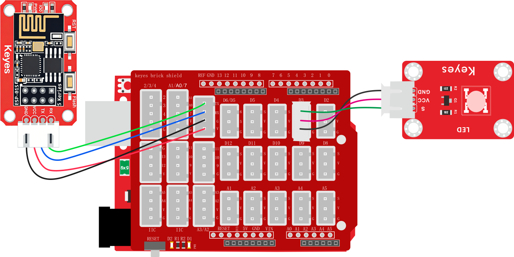
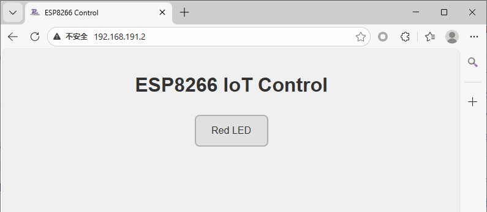

# 2.2.2 WiFi控制LED灯

## 2.2.2.1 简介

使用ESP-01S模块实现对UNO开发板上的LED灯进行WiFi无线控制打开与关闭的功能。课程为基础WiFi控制教程，其他的执行类的模块控制方式都与本课程一样，如舵机、电机等等...

## 2.2.2.2 接线图

<span style="color:red;">注意：UNO代码上传完毕后再将ESP-01S模块连接到UNO扩展板上，连接时注意ESP-01S模块接口的线序，GND对应黑色线，VCC对应红色线，不要接错！！！</span>



## 2.2.2.3 ESP-01S代码

<span style="color:red;">请注意，你需要将SSID 名称与PASSWD 密码修改成你需要连接的WiFi的，并且这个WiFi需要是2.4GHz频段的。</span>

```c
#include <ESP01_Wed.h>

char* WiFi_SSID = "LiuTest";       //你的wifi名称
char* WiFi_Password = "88888888";  //你的wifi密码

// 创建库对象
ESP01_Wed webInterface(WiFi_SSID, WiFi_Password, 750);  // WiFi名称, WiFi密码, 串口波特率

void setup() {
  // 初始化库
  webInterface.begin();

  // 添加传感器显示，将不需要显示的直接注释掉对应的代码即可
  //   webInterface.addSensor("Water Detect", "water", "waterValue");              //水滴传感器数据显示
  //   webInterface.addSensor("Temperature(&deg;C)", "temperature", "tempValue");  //温度数据显示
  //   webInterface.addSensor("Humidity(%RH)", "humidity", "humidityValue");       //湿度数据显示
  //   webInterface.addSensor("LIGHT", "light", "lightValue");                     //光敏传感器数据显示
  //   webInterface.addSensor("Ultrasonic(cm)", "ultrasonic", "ultraValue");       //超声波距离数据显示
  //   webInterface.addSensor("Smoke", "smoke", "smokeValue");                     //烟雾传感器数据显示
  //   webInterface.addSensor("Alcohol", "alcohol", "alcoholValue");               //酒精传感器数据显示
  //   webInterface.addSensor("Soil Moisture", "soil", "soilValue");               //土壤湿度传感器数据显示
  //   webInterface.addSensor("Pot", "pot", "potValue");                           //电位器数据显示器

  // 添加控制按钮，将不需要的按键直接注释掉对应的代码即可
  webInterface.addToggleButton("Red LED", "RED_LED:1", "RED_LED:0");        //添加红光灯控制按键
//   webInterface.addToggleButton("Green LED", "GREEN_LED:1", "GREEN_LED:0");  //添加绿光灯控制按键
//   webInterface.addToggleButton("Blue LED", "BLUE_LED:1", "BLUE_LED:0");     //添加蓝光灯控制按键
//   webInterface.addToggleButton("White LED", "WHITE_LED:1", "WHITE_LED:0");  //添加白光灯控制按键
//   webInterface.addToggleButton("Relay", "RELAY:1", "RELAY:0");              //添加继电器模块控制按键
//   webInterface.addToggleButton("Laser", "LASER:1", "LASER:0");              //添加激光模块控制按键
//   webInterface.addToggleButton("Water Pump", "PUMP:1", "PUMP:0");           //添加水泵控制按键
//   webInterface.addToggleButton("Motor", "MOTOR:1", "MOTOR:0");              //添加电机控制按键
//   webInterface.addToggleButton("Servo", "SERVO:1", "SERVO:0");              //添加舵机控制按键

  // 打印IP地址
  Serial.print("Web server IP: ");
  Serial.println(webInterface.getIP());
}

void loop() {
  // 主循环
  webInterface.loop();
}
```


## 2.2.2.4 ESP-01S 代码说明

① 导入库文件，设置好要连接的wifi名称与密码，创建库对象并设置串口波特率为`750`<span style="color:red;">注意：波特率需要慢一点不能太快，数据传输太快容易丢失数据！！建议波特率为“750”</span>

```c
#include <ESP01_Wed.h>

char* WiFi_SSID = "LiuTest";       //你的wifi名称
char* WiFi_Password = "88888888";  //你的wifi密码

// 创建库对象
ESP01_Wed webInterface(WiFi_SSID, WiFi_Password, 750);  // WiFi名称, WiFi密码, 串口波特率
```

② 再初始化中将需要显示再网页的按键取消注释，并把不需要显示的按键注释掉（在代码前面加`\\`就是代表代码被注释了，被注释的代码将不会执行）

## 2.2.2.5 UNO 代码

<span style="color:red;">注意：串口波特率一定要与ESP8266的波特率匹配，波特率为“750”。还有上传代码时开发板不要连接ESP-01S模块否则会上传失败！！</span>

```c
// 定义LED连接的引脚号（这里是数字引脚3）
int ledPin = 3;

// 用于存储从串口接收到的控制指令字符串
String WiFi_Control = "";

void setup() {
  // 初始化串口通信，波特率设置为750（注意：非标准波特率，需确保通信双方一致）
  Serial.begin(750);

  // 将LED引脚设置为输出模式
  pinMode(ledPin, OUTPUT);  
}

void loop() {
  // 检查串口是否有数据可读
  if (Serial.available()) {
    // 读取直到换行符('\n')的数据，并转换为String类型
    WiFi_Control = Serial.readStringUntil('\n');

    // 去除字符串首尾的空白字符（如回车、空格等）
    WiFi_Control.trim();

    // 将接收到的指令回传到串口，便于调试
    Serial.print("WiFi_Control:");
    Serial.println(WiFi_Control);
  }

  // 判断接收到的指令内容并执行相应操作
  if (WiFi_Control == "RED_LED:1") {
    // 点亮LED（高电平）
    digitalWrite(ledPin, HIGH);
    // 发送应答指令到串口
    Serial.println("ACK:RED_LED:1");

  } else if (WiFi_Control == "RED_LED:0") {
    // 熄灭LED（低电平）
    digitalWrite(ledPin, LOW);
    // 发送应答指令到串口
    Serial.println("ACK:RED_LED:0");
  }
  // 清除指令字符串，避免重复执行
  WiFi_Control = "";  
}
```


## 2.2.2.6 UNO代码说明

① 设置串口波特率为`750`，这个串口是用来打印接收数据的

```c
  // 初始化串口通信，波特率设置为750（注意：非标准波特率，需确保通信双方一致）
  Serial.begin(750);
```

② 添加一个变量，名称为`WiFi_Control` ，类型为`String`

```c
// 用于存储从串口接收到的控制指令字符串
String WiFi_Control = "";
```

③ 使用`if`判断是否有数据从串口发送过来

```c
  // 检查串口是否有数据可读
if (Serial.available()){
    ...
}
```

④ 使用变量`WiFi_Control`读取串口的数据并直到`\n`

```c
// 读取直到换行符('\n')的数据，并转换为String类型
    WiFi_Control = Serial.readStringUntil('\n');
```

⑤ 使用文本栏中的消除非可见数据函数`.trim()`，消除变量`WiFi_Control`多余的无用的数据 ，使用串口打印变量`WiFi_Control`

```c
    // 去除字符串首尾的空白字符（如回车、空格等）
    WiFi_Control.trim();

    // 将接收到的指令回传到串口，便于调试
    Serial.print("WiFi_Control:");
    Serial.println(WiFi_Control);
```

⑥ 使用`if`对变量`WiFi_Control`进行判断是否等于`RED LED:1`，设置D3引脚输出高电平，发送应答指令`ACK:RED_LED:1`到串口这一步很重要只有你发送应答指令了ESP-01S才知道你正确的接收到了它发送的命令并且已经执行了。

```c
// 判断接收到的指令内容并执行相应操作
  if (WiFi_Control == "RED_LED:1") {
    // 点亮LED（高电平）
    digitalWrite(ledPin, HIGH);
    // 发送应答指令到串口
    Serial.println("ACK:RED_LED:1");
  }
```

⑦ 添加一个`else if`判断变量`WiFi_Control`进行判断是否等于`RED LED:0`，然后再下方设置D3引脚输出为低电平。（注意：每个按键状态都匹配一个按键应答指令，应答指令其实就是在控制指令的前面加了`ACK:`，如红色led灯打开的控制指令是`RED_LED:1`那么应答指令就是`ACK:RED_LED:1`)

```c
else if (WiFi_Control == "RED_LED:0") {
    // 熄灭LED（低电平）
    digitalWrite(ledPin, LOW);
    // 发送应答指令到串口
    Serial.println("ACK:RED_LED:0");
  }
```

⑧ 清除变量`WiFi_Control`中的值

```c
  // 清除指令字符串，避免重复执行
  WiFi_Control = "";  
```


## 2.2.2.7 代码结果

分别将ESP-01S与UNO开发板的代码上传成功后，将ESP-01S连接到UART口。按一下“ESP-01S Arduino wifi转串口扩展板”上的`RST`按键使ESP-01S模块复位重新连接WiFi并通过UNO开发板的串口打印IP地址，然后再连接同一个wifi设备的浏览器中输入IP搜索进入网页控制页面。




