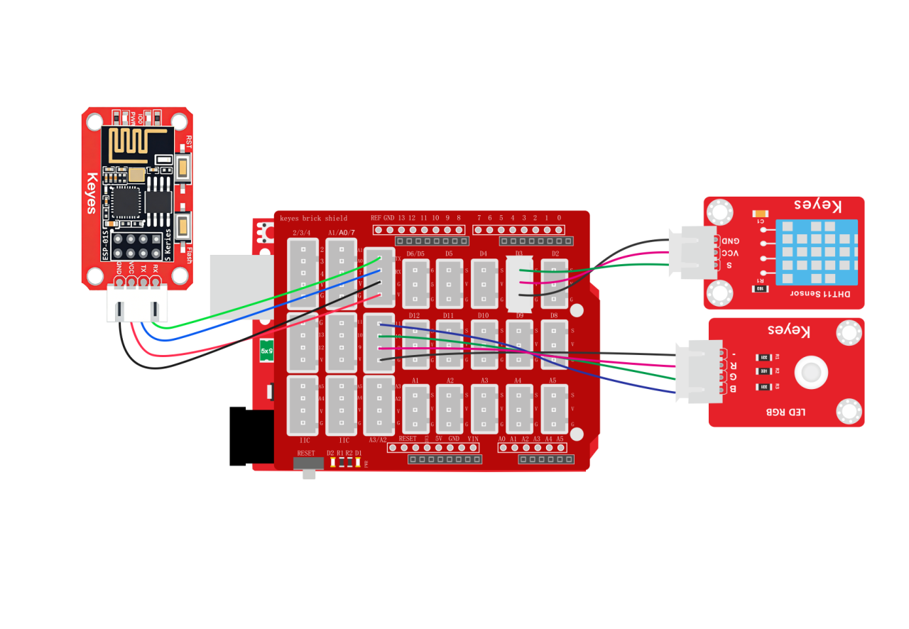
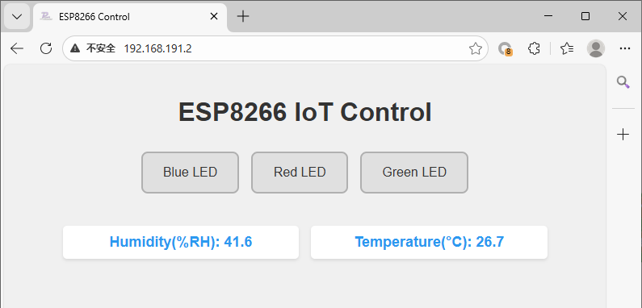

### 2.2.6 wifi控制系统

**1. 简介**

我们学会了如何使用ESP-01S模块控制LED灯，也学了如何使用ESP-01S模块读取数据，那么接下来我们将他们控制与读取数据集合到一起做一个示例，我们将控制RGB灯的三个LED灯的亮灭，并且还要显示温度与湿度在控制页面上。

**2. 接线**

<span style="color:red;">注意：UNO代码上传完毕后再将ESP-01S模块连接到UNO扩展板上，连接时注意ESP-01S模块接口的线序，GND对应黑色线，VCC对应红色线，不要接错！！！</span>



**3. ESP-01S 代码**

<span style="color:red;">注意：波特率需要慢一点不能太快，因为数据传输太快容易丢失数据！！建议波特率为“750”</span>

<span style="color:red;">请注意，你需要将SSID 名称与PASSWD 密码修改成你需要连接的WiFi的，并且这个WiFi需要是2.4GHz频段的。</span>

```c
#include <ESP01_Wed.h>

char* WiFi_SSID = "LiuTest";       //你的wifi名称
char* WiFi_Password = "88888888";  //你的wifi密码

// 创建库对象
ESP01_Wed webInterface(WiFi_SSID, WiFi_Password, 750);  // SSID, 密码, 串口波特率

void setup() {
  // 初始化库
  webInterface.begin();

  // 添加传感器显示，将不需要显示的直接注释掉对应的代码即可
  //   webInterface.addSensor("Water Detect", "water", "waterValue");              //水滴传感器数据显示
    webInterface.addSensor("Temperature(&deg;C)", "temperature", "tempValue");  //温度数据显示
    webInterface.addSensor("Humidity(%RH)", "humidity", "humidityValue");       //湿度数据显示
  //   webInterface.addSensor("LIGHT", "light", "lightValue");                     //光敏传感器数据显示
  //   webInterface.addSensor("Ultrasonic(cm)", "ultrasonic", "ultraValue");       //超声波距离数据显示
  //   webInterface.addSensor("Smoke", "smoke", "smokeValue");                     //烟雾传感器数据显示
  //   webInterface.addSensor("Alcohol", "alcohol", "alcoholValue");               //酒精传感器数据显示
  //   webInterface.addSensor("Soil Moisture", "soil", "soilValue");               //土壤湿度传感器数据显示
    // webInterface.addSensor("Pot", "pot", "potValue");                           //电位器数据显示器

  // 添加控制按钮，将不需要的按键直接注释掉对应的代码即可
  webInterface.addToggleButton("Red LED", "RED_LED:1", "RED_LED:0");        //添加红光灯控制按键
  webInterface.addToggleButton("Green LED", "GREEN_LED:1", "GREEN_LED:0");  //添加绿光灯控制按键
  webInterface.addToggleButton("Blue LED", "BLUE_LED:1", "BLUE_LED:0");     //添加蓝光灯控制按键
//   webInterface.addToggleButton("White LED", "WHITE_LED:1", "WHITE_LED:0");  //添加白光灯控制按键
//   webInterface.addToggleButton("Relay", "RELAY:1", "RELAY:0");              //添加继电器模块控制按键
//   webInterface.addToggleButton("Laser", "LASER:1", "LASER:0");              //添加激光模块控制按键
//   webInterface.addToggleButton("Water Pump", "PUMP:1", "PUMP:0");           //添加水泵控制按键
//   webInterface.addToggleButton("Motor", "MOTOR:1", "MOTOR:0");              //添加电机控制按键
//   webInterface.addToggleButton("Servo", "SERVO:1", "SERVO:0");              //添加舵机控制按键

  // 打印IP地址
  Serial.print("Web server IP: ");
  Serial.println(webInterface.getIP());
}

void loop() {
  // 主循环
  webInterface.loop();
}
```

**4. ESP-01S 代码说明**

打开`ESP01_S代码`中的代码文件，将不用显示的按键以及传感器数据显示注释掉，将温度与湿度数据显示以及控制红绿蓝三个颜色led的按键取消注释即可（你也可以使用快捷键`Ctrl + /`，鼠标光标点击到需要注释的代码行或选中的代码多行代码按`Ctrl + /`即可达到注释或者取消注释的效果 ）

**5. UNO 代码**

<span style="color:red;">注意：串口波特率一定要与ESP8266的波特率匹配。波特率为“750”</span>

```c
#include <dht11.h>  //include the library code:
dht11 DHT;
#define DHT11_PIN 3  //定义DHT11为数子口3

// 定义LED连接的引脚号
int redLedPin = 9;
int greenLedPin = 10;
int blueLedPin = 11;

// 用于存储从串口接收到的控制指令字符串
String WiFi_Control = "";

void dht11_chk() {
  int chk;
  chk = DHT.read(DHT11_PIN);  // READ DATA
  switch (chk) {
    case DHTLIB_OK:
      break;
    case DHTLIB_ERROR_CHECKSUM:  //校检和错误返回
      break;
    case DHTLIB_ERROR_TIMEOUT:  //超时错误返回
      break;
    default:
      break;
  }
}

void setup() {
  // 初始化串口通信，波特率设置为750（注意：非标准波特率，需确保通信双方一致）
  Serial.begin(750);

  // 将引脚设置为输入模式
  pinMode(DHT11_PIN, INPUT);

  // 将LED引脚设置为输出模式
  pinMode(redLedPin, OUTPUT);
  pinMode(greenLedPin, OUTPUT);
  pinMode(blueLedPin, OUTPUT);
}

void loop() {
  //检查DHT11数据是否正常
  dht11_chk();
  //读取传感器数据
  int TempValue = DHT.temperature;
  int HumValue = DHT.humidity;

  // 检查串口是否有数据可读
  if (Serial.available()) {
    // 读取直到换行符('\n')的数据，并转换为String类型
    WiFi_Control = Serial.readStringUntil('\n');

    // 去除字符串首尾的空白字符（如回车、空格等）
    WiFi_Control.trim();

    // 将接收到的指令回传到串口，便于调试
    Serial.print("WiFi_Control:");
    Serial.println(WiFi_Control);
  }

  // 判断接收到的指令内容是否是发送数据指令"SENSOR_READ"
  if (WiFi_Control == "SENSOR_READ") {
    //请注意串口发送的数据格式为 “名称:数据”，如温度的值是25就是“TEMP:25”
    Serial.println("TEMP:" + String(TempValue));  //发送温度数据给ESP-01S
    Serial.println("HUM:" + String(HumValue));    //发送湿度数据给ESP-01S
  } else if (WiFi_Control == "RED_LED:1") {
    // 点亮LED（高电平）
    digitalWrite(redLedPin, HIGH);
    // 发送应答指令到串口
    Serial.println("ACK:RED_LED:1");

  } else if (WiFi_Control == "RED_LED:0") {
    // 熄灭LED（低电平）
    digitalWrite(redLedPin, LOW);
    // 发送应答指令到串口
    Serial.println("ACK:RED_LED:0");
  } else if (WiFi_Control == "GREEN_LED:1") {
    // 熄灭LED（低电平）
    digitalWrite(greenLedPin, HIGH);
    // 发送应答指令到串口
    Serial.println("ACK:GREEN_LED:1");
  } else if (WiFi_Control == "GREEN_LED:0") {
    // 熄灭LED（低电平）
    digitalWrite(greenLedPin, LOW);
    // 发送应答指令到串口
    Serial.println("ACK:GREEN_LED:0");
  } else if (WiFi_Control == "BLUE_LED:1") {
    // 熄灭LED（低电平）
    digitalWrite(blueLedPin, HIGH);
    // 发送应答指令到串口
    Serial.println("ACK:BLUE_LED:1");
  } else if (WiFi_Control == "BLUE_LED:0") {
    // 熄灭LED（低电平）
    digitalWrite(blueLedPin, LOW);
    // 发送应答指令到串口
    Serial.println("ACK:BLUE_LED:0");
  }
  // 清除指令字符串，避免重复执行
  WiFi_Control = "";
}
```

**6. UNO代码说明**

① 基础代码都是一样的

② 使用`if`判断`WiFi_Control`的值是否是ESP-01S发送过来的发送传感器数据指令，如果是就对数据进行逐个发送，我们需要发送温度与湿度的数据

③ 使用`if`对ESP-01S发送过来的按键控制指令进行判断指令与按键名称以及当前的状态匹配就执行下方的代码

**7. 代码结果**

分别将ESP-01S与UNO开发板的代码上传成功后，将ESP-01S连接到UART口。按一下“ESP-01S Arduino wifi转串口扩展板”上的`RST`按键使ESP-01S模块复位重新连接WiFi并通过UNO开发板的串口打印IP地址，然后再连接同一个wifi设备的浏览器中输入IP搜索进入网页控制页面。

点击按键即可控制led灯的亮灭，并且温度与湿度的数据也会实时刷新再页面中。


