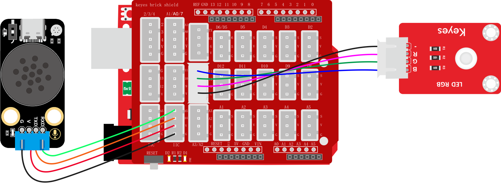

# 2.3.3 语音控制多个灯

## 2.3.3.1 简介

前面我们学习了，如何使用小智语音模块控制一个LED灯，那么现在我们将他扩展成控制多个LED灯。

## 2.3.3.2 控制指令表

| 命令码 |             命令词             | 命令回复 |
| :----: | :----------------------------: | :------: |
|   1    | 开红灯，打开红色灯，打开楼道灯 |  已打开  |
|   2    | 关红灯，关闭红色灯，关闭楼道灯 |  已关闭  |
|   5    | 开绿灯，打开绿色灯，打开厨房灯 |  已打开  |
|   6    | 关绿灯，关闭绿色灯，关闭厨房灯 |  已关闭  |
|   7    | 开蓝灯，打开蓝色灯，打开卧室灯 |  已打开  |
|   8    | 关蓝灯，关闭蓝色灯，关闭卧室灯 |  已关闭  |
|        |                                |          |

## 2.3.3.3 接线图



## 2.3.3.4 代码

```c
// 引入SoftwareSerial库，用于创建软串口
#include <SoftwareSerial.h>

// 创建软串口对象：RX引脚为A5，TX引脚为A4
// 用于连接语音识别模块
SoftwareSerial mySerial(A5, A4);
// 定义LED连接的引脚号
int RedLedPin = 9;
int GreenLedPin = 10;
int BlueLedPin = 11;

// 定义变量用于存储从语音模块接收到的控制码
volatile int Voice_Control = 0;  // 初始化为0，确保首次判断时不触发任何指令

void setup() {
  // 初始化硬件串口，用于调试输出，波特率9600
  Serial.begin(9600);
  // 初始化软串口，用于连接语音模块，波特率9600
  mySerial.begin(9600);
  // 将LED引脚设置为输出模式
  pinMode(RedLedPin, OUTPUT);
  pinMode(GreenLedPin, OUTPUT);
  pinMode(BlueLedPin, OUTPUT);
}

void loop() {
  // 检查软串口是否有来自语音模块的数据可读
  if (mySerial.available()) {
    // 从软串口读取一个字节的数据
    Voice_Control = mySerial.read();
    // 将接收到的数据通过硬件串口输出到串口监视器，便于调试
    Serial.println(Voice_Control);
  }
      // 根据接收到的指令值执行相应操作
    if (Voice_Control == 1) {
      // 当接收到值1时，点亮LED（高电平）
      digitalWrite(RedLedPin, HIGH);

    } else if (Voice_Control == 2) {
      // 当接收到值2时，熄灭LED（低电平）
      digitalWrite(RedLedPin, LOW);
    } else if (Voice_Control == 5) {
      // 当接收到值5时，点亮LED（高电平）
      digitalWrite(GreenLedPin, HIGH);
    } else if (Voice_Control == 6) {
      // 当接收到值2时，熄灭LED（低电平）
      digitalWrite(GreenLedPin, LOW);
    } else if (Voice_Control == 7) {
      // 当接收到值7时，点亮LED（高电平）
      digitalWrite(BlueLedPin, LOW);
    } else if (Voice_Control == 8) {
      // 当接收到值8时，熄灭LED（低电平）
      digitalWrite(BlueLedPin, LOW);
    }
	  // 清除指令，避免重复执行
  Voice_Control = 0;
}

```


## 2.3.3.5 代码说明

① 代码逻辑总体与控制一个LED灯是一样的，只是对应不同的灯有着不一样的指令码，需要对应指令码表格进行编写，其实就是语音模块识别我们的指令后它会通过模拟串口发送指令到开发板，开发板接受执行然后通过对指令码的判断执行相应的功能即可。

## 2.3.3.6 代码结果

上传代码成功后，使用唤醒词“小智小智”唤醒小智语音模块，他会回答你“我在”然后你就可以使用命令词进行控制它了，如当前教程，我们就可以这样

**开红灯示例：** 你：“小智小智” ，小智：“我在”，你：“开红灯” 或 “打开红色灯” 或 “打开楼道灯”，小智：“已打开”

**关红灯示例：** 你：“小智小智” ，小智：“我在”，你：“关红灯” 或 “关闭红色灯” 或 “关闭楼道灯”，小智：“已关闭”

**开绿灯示例：** 你：“小智小智” ，小智：“我在”，你：“开绿灯” 或 “打开绿色灯” 或 “打开厨房灯”，小智：“已打开”

**关绿灯示例：** 你：“小智小智” ，小智：“我在”，你：“关绿灯” 或 “关闭绿色灯” 或 “关闭厨房灯”，小智：“已关闭”

**开蓝灯示例：** 你：“小智小智” ，小智：“我在”，你：“开蓝灯” 或 “打开蓝色灯” 或 “打开卧室灯”，小智：“已打开”

**关红蓝示例：** 你：“小智小智” ，小智：“我在”，你：“关蓝灯” 或 “关闭蓝色灯” 或 “关闭卧室灯”，小智：“已关闭”

