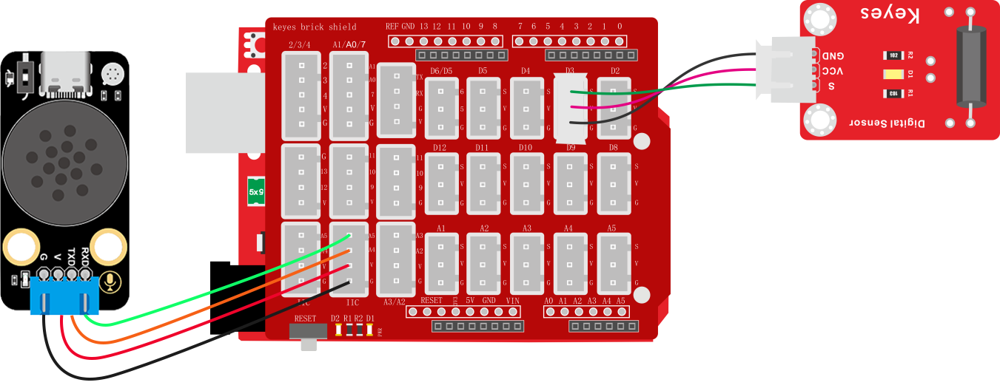

### 2.3.4 语音播报倾斜

**1. 简介**

使用小智语音模块语音控制读取UNO开发板连接的传感器的值，我们先使用一个简单语音控制读取的功能熟悉一下代码以及逻辑。以便后面的课程理解。

**2. 控制指令表**

接收到UNO开发板发送过来的消息号，语音模块便会播出设置好的语音。

| 消息号 | 播放语音     |
| :----: | ------------ |
|   10   | 警告发生倾斜 |

**3. 接线图**



**4. 代码**

```c
// 引入SoftwareSerial库，用于创建软串口通信
#include <SoftwareSerial.h>

// 创建软串口对象，使用A5作为RX引脚接收数据，A4作为TX引脚发送数据
SoftwareSerial mySerial(A5, A4);

// 定义变量用于存储从语音模块接收到的控制码
volatile int Voice_Control = 0;  // 初始化为0，确保首次判断时不触发任何指令

// 定义倾斜传感器连接的引脚号
int TiltPin = 3;

/*
 函数功能：通过串口发送具有固定帧格式的数据包
 数据包格式：帧头(0xAA 0x55) + 消息号数据 + 数据1 + 数据2 + 帧尾(0x55 0xAA)
 
 输入参数说明：
  ---Message_Number ：消息号，用于标识命令类型   <必需填写>
  ---data1 ：第一个数据参数  <如果没有数据就输入0>
  ---data2 ：第二个数据参数  <如果没有数据就输入0>
 */
void Uart_SendCmd(int Message_Number, int data1, int data2) {
  // 发送帧头：固定字节0xAA和0x55，用于标识数据包的开始
  mySerial.write(0XAA);
  mySerial.write(0X55);

  // 发送消息号，标识具体的命令类型
  mySerial.write(Message_Number);

  // 发送两个数据参数
  mySerial.write(data1);
  mySerial.write(data2);

  // 发送帧尾：固定字节0x55和0xAA，用于标识数据包的结束
  mySerial.write(0X55);
  mySerial.write(0XAA);
}

void setup() {
  // 初始化硬件串口，用于调试和监控，波特率9600
  Serial.begin(9600);

  // 初始化软串口，用于与语音模块通信，波特率9600
  mySerial.begin(9600);

  // 将引脚设置为输入模式，用于检测外部信号
  pinMode(TiltPin, INPUT);
}

void loop() {
  //读取倾斜传感器的状态并赋值给变量
  int TiltValue = digitalRead(TiltPin);
  // 持续检查软串口是否有来自语音模块的数据
  while (mySerial.available()) {
    // 读取一个字节的数据
    Voice_Control = mySerial.read();

    // 将接收到的数据通过硬件串口输出，便于调试和监控
    Serial.println(Voice_Control);
  }

  //通过变量判断倾斜传感器的状态，等于0倾斜，等于1正常
  if (TiltValue == 0) {
    // 变量等于0时，通过软串口发送一个命令数据包
    // 消息号为10，两个数据参数都为0
    Uart_SendCmd(10, 0, 0);
  }
}
```

**5. 代码说明**

① 导入模拟串口库文件；创建模拟串口对象并设置模拟串口引脚为：RX：A5，TX：A4  ；定义读取倾斜传感器状态的引脚为D3 ；创建一个`int`类型变量名称为`Voice_Control`用于存放语音模块发送过来的控制指令

```c
// 引入SoftwareSerial库，用于创建软串口
#include <SoftwareSerial.h>

// 创建软串口对象：RX引脚为A5，TX引脚为A4
// 用于连接语音识别模块
SoftwareSerial mySerial(A5, A4);

// 定义倾斜传感器连接的引脚号
int TiltPin = 3;

// 定义变量用于存储从语音模块接收到的控制码
volatile int Voice_Control = 0;  // 初始化为0，确保首次判断时不触发任何指令
```

② 创建发送消息号到语音模块的函数，函数名称为“Uart_SendCmd” ； 为函数添加输入参数，第一个参数为整数类型名称为`Message_Number`（是用来存放需要发送消息号的)，第二个参数为整数类型名称为`data1`（是用来存放需要发送的数据的)，第三个参数为整数类型名称为`data2`（也是用来存放需要发送的数据的，与dsta1不同的是，如果消息号对应一个数据那就data2为0即可，如果对应两个数据就启用data2，如时钟需要数据时，数据分的时候就要用到两个数据位)

```c
/*
 函数功能：通过串口发送具有固定帧格式的数据包
 数据包格式：帧头(0xAA 0x55) + 消息号数据 + 数据1 + 数据2 + 帧尾(0x55 0xAA)
 输入参数说明：
  ---Message_Number ：消息号，用于标识命令类型   <必需填写>
  ---data1 ：第一个数据参数  <如果没有数据就输入0>
  ---data2 ：第二个数据参数  <如果没有数据就输入0>
 */
void Uart_SendCmd(int Message_Number, int data1, int data2) {
  // 发送帧头：固定字节0xAA和0x55，用于标识数据包的开始
  mySerial.write(0XAA);
  mySerial.write(0X55);
  // 发送消息号，标识具体的命令类型
  mySerial.write(Message_Number);
  // 发送两个数据参数
  mySerial.write(data1);
  mySerial.write(data2);
  // 发送帧尾：固定字节0x55和0xAA，用于标识数据包的结束
  mySerial.write(0X55);
  mySerial.write(0XAA);
}
```

③ 设置串口波特率为`9600` ； 设置模拟串口波特率为`9600` ；将读取倾斜传感器状态的引脚设置为输出模式

```c
  // 初始化硬件串口，用于调试和监控，波特率9600
  Serial.begin(9600);
  // 初始化软串口，用于与语音模块通信，波特率9600
  mySerial.begin(9600);
  // 将引脚设置为输入模式，用于检测外部信号
  pinMode(TiltPin, INPUT);
```

④ 添加一个`int`类型变量设置变量名称为`TiltValue`并将读取到的倾斜传感器的值赋值给这个变量；使用`if`判断模拟串口中是否有数据发送过来 ；如果有数据发送过来就读取数据并将数据赋值给变量`Voice_Control` ；使用串口换行打印变量`Voice_Control`的值（只能使用串口打印模拟串口不行）方便观察接收到的指令值

```c
  //读取倾斜传感器的状态并赋值给变量
  int TiltValue = digitalRead(TiltPin);
  // 持续检查软串口是否有来自语音模块的数据
  while (mySerial.available()) {
    // 读取一个字节的数据
    Voice_Control = mySerial.read();
    // 将接收到的数据通过硬件串口输出，便于调试和监控
    Serial.println(Voice_Control);
  }
```

⑤  使用`if`语句对变量`TiltValue`的值进行判断如果等于0，就发送消息号让语音模块播报倾斜警告的语音，播报倾斜警告语音的消息号为`10`

```c
  //通过变量判断倾斜传感器的状态，等于0倾斜，等于1正常
  if (TiltValue == 0) {
    // 变量等于0时，通过软串口发送一个命令数据包
    // 消息号为10，两个数据参数都为0
    Uart_SendCmd(10, 0, 0);
  }
```

**6. 代码结果**

上传代码成功后，将倾斜模块向一遍倾斜如果倾斜传感器返回的数字信号为0，则语音模块就回发出"警告，发生倾斜"


