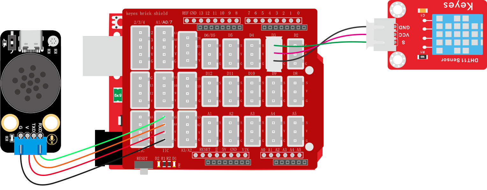

# 2.3.5 语音播报温度与湿度

## 2.3.5.1 简介

我们学会了发送消息号给语音模块从而控制它播报对应的声音，那么接下来我们要学习发送消息号以及传感器数据给语音模块，让语音模块播报出语音+传感器数据，如：当前温度是 二十五摄氏度 或 当前湿度是百分之 五十 等等...

## 2.3.5.2 控制指令表

**命令参数表：**

| 命令码 |             命令词             |     命令回复     |
| :----: | :----------------------------: | :--------------: |
|   25   | “当前温度” 或 “现在温度是多少” | 正在读取环境温度 |
|   26   | “当前湿度” 或 “现在湿度是多少” | 正在读取环境湿度 |

**消息号表：**

| 消息号 |          播报语音          |
| :----: | :------------------------: |
|   2    | 当前温度是 “温度值” 摄氏度 |
|   3    | 当前湿度是百分之 “湿度值”  |

## 2.3.5.3 接线图



## 2.3.5.4 代码

```c
// 引入库
#include <SoftwareSerial.h>
#include <dht11.h>

//创建DHT11对象
dht11 DHT;
#define DHT11_PIN 3  //定义DHT11为数字口3

// 创建软串口对象，使用A5作为RX引脚接收数据，A4作为TX引脚发送数据
SoftwareSerial mySerial(A5, A4);

// 定义变量用于存储从语音模块接收到的控制码
volatile int Voice_Control = 0;  // 初始化为0，确保首次判断时不触发任何指令

/*
 函数功能：通过串口发送具有固定帧格式的数据包
 数据包格式：帧头(0xAA 0x55) + 消息号数据 + 数据1 + 数据2 + 帧尾(0x55 0xAA)
 
 输入参数说明：
  ---Message_Number ：消息号，用于标识命令类型   <必需填写>
  ---data1 ：第一个数据参数  <如果没有数据就输入0>
  ---data2 ：第二个数据参数  <如果没有数据就输入0>
 */
void Uart_SendCmd(int Message_Number, int data1, int data2) {
  // 发送帧头：固定字节0xAA和0x55，用于标识数据包的开始
  mySerial.write(0XAA);
  mySerial.write(0X55);

  // 发送消息号，标识具体的命令类型
  mySerial.write(Message_Number);

  // 发送两个数据参数
  mySerial.write(data1);
  mySerial.write(data2);

  // 发送帧尾：固定字节0x55和0xAA，用于标识数据包的结束
  mySerial.write(0X55);
  mySerial.write(0XAA);
}

void dht11_chk() {
  int chk;
  chk = DHT.read(DHT11_PIN);  // READ DATA
  switch (chk) {
    case DHTLIB_OK:
      break;
    case DHTLIB_ERROR_CHECKSUM:  //校检和错误返回
      break;
    case DHTLIB_ERROR_TIMEOUT:  //超时错误返回
      break;
    default:
      break;
  }
}

void setup() {
  // 初始化硬件串口，用于调试和监控，波特率9600
  Serial.begin(9600);
  // 初始化软串口，用于与语音模块通信，波特率9600
  mySerial.begin(9600);

  // 将引脚设置为输入模式
  pinMode(DHT11_PIN, INPUT);
}

void loop() {
  //检查DHT11数据是否正常
  dht11_chk();
  //读取传感器数据
  int TempValue = DHT.temperature;
  int HumValue = DHT.humidity;

  // 持续检查软串口是否有来自语音模块的数据
  while (mySerial.available()) {
    // 读取一个字节的数据
    Voice_Control = mySerial.read();
    // 将接收到的数据通过硬件串口输出，便于调试和监控
    Serial.println(Voice_Control);
  }
  // 判断接收到的指令数值并执行相应操作
  if (Voice_Control == 25) {
    // 指令码为25时发送消息号2，data1为温度值，data2为0
    Uart_SendCmd(2, TempValue, 0);
  } else if (Voice_Control == 26) {
    // 指令码为26时发送消息号3，data1为湿度值，data2为0
    Uart_SendCmd(3, HumValue, 0);
  }
  // 清除指令，避免重复执行
  Voice_Control = 0;
}
```


## 2.3.5.5 代码说明

① 基本代码语播报倾斜课程一致，不在重复

② 当我们唤醒语音模块并询问他"当前温度"，语音模块就会发送一个命令码`25`过来，然后通过判断这个命令码执行发送温度消息号以及数据给语音模块，我们使用`if`语句来实现，判断变量`Voice_Control`是否等于对应语音的指令码，如果是就执行下方的代码。

③ 我们使用同样的方法搭建出播报湿度的代码

<span style="color:red;">注意：指令码`25`是读取温度的命令码可以对照表格寻找 ；函数`Uart_SendCmd`中参数`Message_Number`是消息号可以对照表格寻找 ；参数`data1`是温度数据 ；参数`data2`是空值所以是0</span>

```c
  // 判断接收到的指令数值并执行相应操作
  if (Voice_Control == 25) {
    // 指令码为25时发送消息号2，data1为温度值，data2为0
    Uart_SendCmd(2, TempValue, 0);
  } else if (Voice_Control == 26) {
    // 指令码为26时发送消息号3，data1为湿度值，data2为0
    Uart_SendCmd(3, HumValue, 0);
  }
```


## 2.3.5.6 代码结果

上传代码成功后，使用唤醒词“小智小智”唤醒小智语音模块，他会回答你“我在”然后你就可以使用命令词进行控制它了，如当前教程，我们就可以这样

**播报温度示例：** 你：“小智小智” ，小智：“我在”，你：“当前温度” 或 “现在温度是多少” ，小智：“当前温度是"温度值"摄氏度”

**播报湿度示例：** 你：“小智小智” ，小智：“我在”，你：“当前湿度” 或 “现在湿度是多少” ，小智：“当前湿度是百分之"湿度值"”

