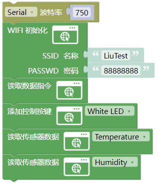
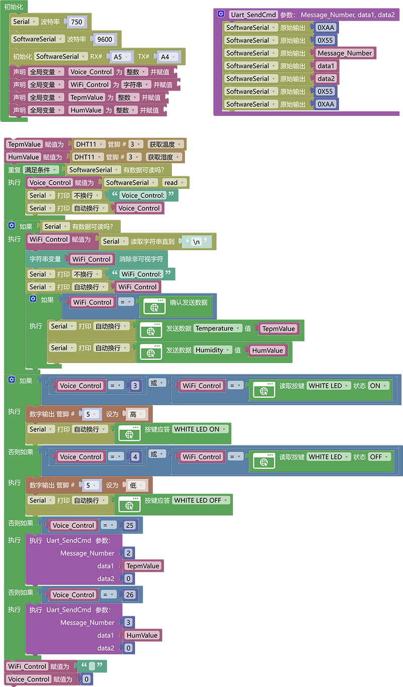

# 3.4.4 智能孵蛋系统

## 3.4.4.1 简介 

了解到正常可孵化的鸡蛋需要满足以下基础条件才能孵化，第一个是温度再37.5℃~37.8℃，第二个是湿度保持再50%-60%之间。知道了条件我们就能利用我们手中的DHT11对环境中的温度与湿度进行检测，而温度的更改则交给3W的白光灯（这里我们是做模拟）因为大功率的灯光是会发热的，我们使用ESP-01S模块进行远程传输温度与湿度数据方便实时查看以及控制灯光打开加温熄灭降温操作，使用语音模块进行语音控制播报当前温度与湿度。

## 3.4.4.2 接线图

注意：UNO代码上传完毕后再将ESP-01S模块连接到UNO扩展板上，连接时注意ESP-01S模块接口的线序，GND对应黑色线，VCC对应红色线，不要接错！！！

## 3.4.4.3 ESP-01S 代码

请注意，你需要将SSID 名称与PASSWD 密码修改成你需要连接的WiFi的，并且这个WiFi需要是2.4GHz频段的。

## 3.4.4.4 UNO 代码

## 3.4.4.5 UNO 代码说明

① 设置好串口波特率为`750`，模拟串口波特率为`9600`，模拟串口引脚为RX：A5，TX：A4，设置接收数据变量

② 判断语音模块是否通过模拟串口发送控制数据过来如果有就将控制数据赋值给变量`Voice_Control`

③ 搭建语音发送数据函数`Uart_SendCmd`

③ 判断WiFi模块是否通过串口发送控制数据过来，如果有就将控制数据赋值给变量给变量`WiFi_Control`，判断变量`WiFi_Control`重的数据是否等于`确认发送数据`指令，如果是就依次使用串口打印模块发送数据。

④ 使用逻辑或对语音控制模块的控制指令和wifi控制模块的指令进行判断，只要有一个条件满足就执行相应的功能代码（注意：每个WiFi控制的功能代码都要做一个应答否则将无法实现控制效果）

## 3.4.4.6 代码结果

上传代码成功后，等待WiFi连接成功你将可以通过浏览器输入ESP-01S的IP地址进入控制页面，页面中实时显示温度与湿度并且还能控制3W LED等的亮灭。

语音模块控制示例：

**播报温度示例：** 你：“小智小智” ，小智：“我在”，你：“当前温度” 或 “现在温度是多少” ，小智：“当前温度是"温度值"摄氏度”

**播报湿度示例：** 你：“小智小智” ，小智：“我在”，你：“当前湿度” 或 “现在湿度是多少” ，小智：“当前湿度是百分之"湿度值"”

**打开3W LED示例：：** 你：“小智小智” ，小智：“我在”，你：“开白灯” 或 “开灯” 或 “打开客厅灯”，小智：“已打开”

**关闭3W LED示例：：** 你：“小智小智” ，小智：“我在”，你：“关白灯” 或 “关灯” 或 “关闭客厅灯”，小智：“已关闭”

