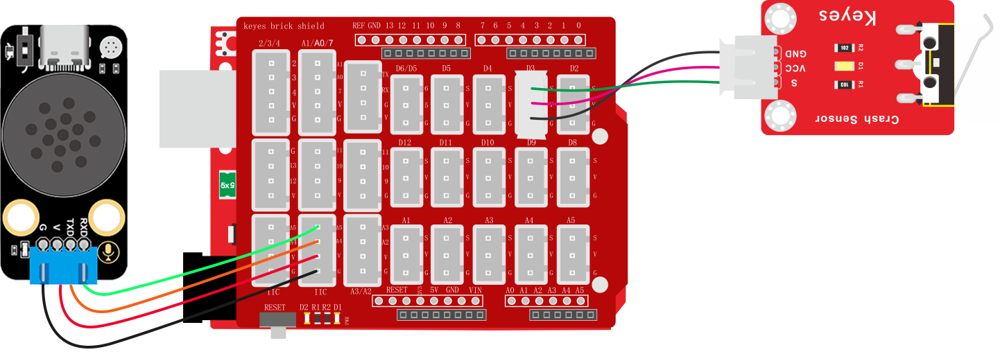
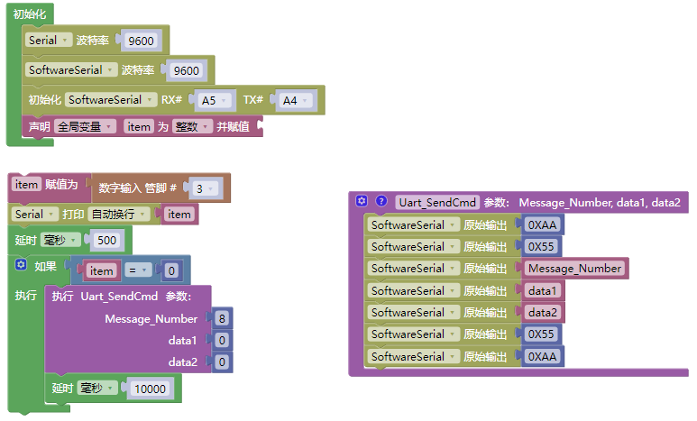

# 3.5.2 撞击报警器

## 3.5.2.1 简介

当碰撞传感器触发的时候，语音模块就会发出警告提示音“警告，受到撞击”，这像是一个防御装置，就像科幻片中那样警告房子或者别的物品受到了撞击。

## 3.5.2.2 控制指令表

**消息号表：**

| 消息号 |    播报语音    |
| :----: | :------------: |
|   8    | 警告，受到撞击 |

## 3.5.2.3 接线图

## 3.5.2.4 代码

## 3.5.2.5 代码说明

① 设置串口以及模拟串口的波特率为`9600`，设置模拟串口引脚为RX：A5，TX：A4，设置全局变量`item`用于存放碰撞模块状态值

② 搭建发送消息号函数

③ 读取碰撞模块状态值并赋值给变量`item`，使用串口打印变量`item`方便监控传感器数据，延时500毫秒

④ 使用判断模块对变量`item`的值进行判断如果等于`0`则发送播报撞击警报的消息号`9`给语音模块，语音模块根据消息号匹配是语音进行播报

⑤ 延时10秒钟，让播报声有间隔

## 3.5.2.6 代码结果

上传测试代码成功，打开串口查看打印的碰撞传感器的状态值，如果发送碰撞语音模块便会发出警告提示声“警告，受到撞击”。