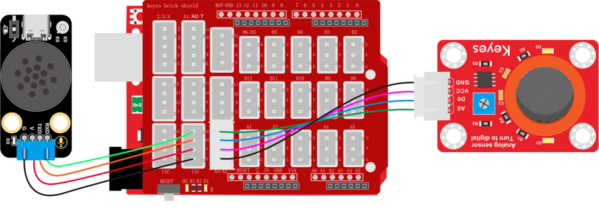
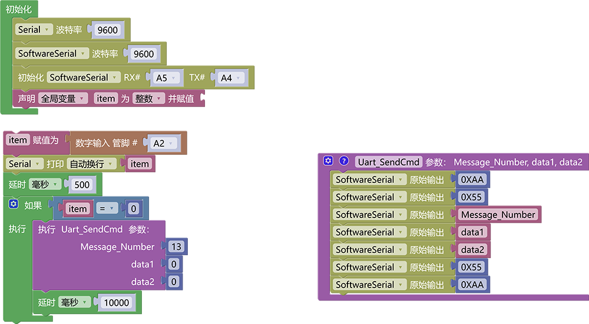

# 3.5.5 酒精报警器

## 3.5.5.1 简介

当酒精传感器检测到酒精时，语音模块就会发出警告提示音“警告，酒精泄露”。

## 3.5.5.2 控制指令表

**消息号表：**

| 消息号 |    播报语音    |
| :----: | :------------: |
|   13   | 警告，酒精泄露 |

## 3.5.5.3 接线图

## 3.5.5.4 代码

## 3.5.5.5 代码结果

上传测试代码成功，打开串口查看打印的酒精传感器状态值，如果酒精传感器检测到了酒精则会报警“警告，酒精泄露”
