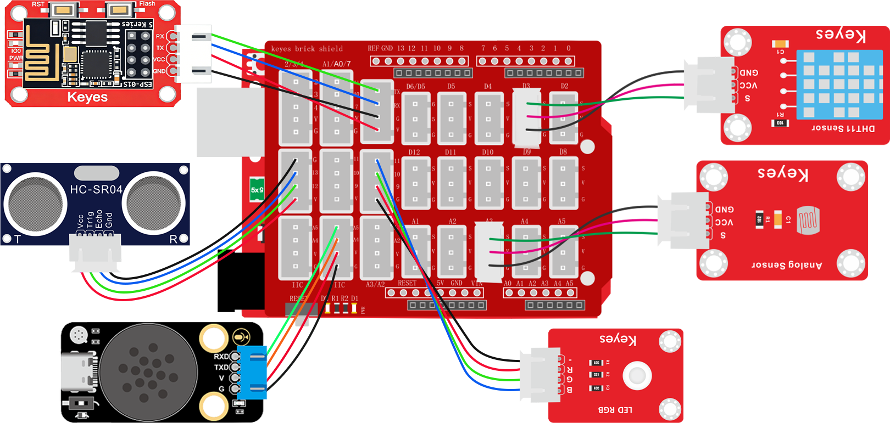
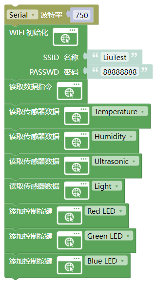
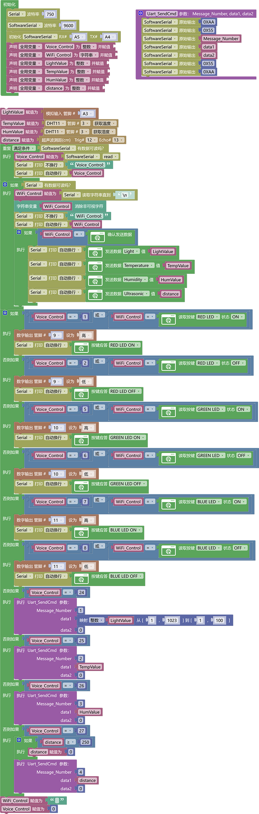
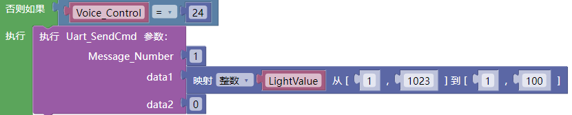
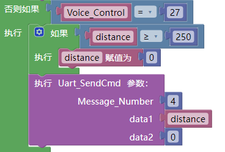
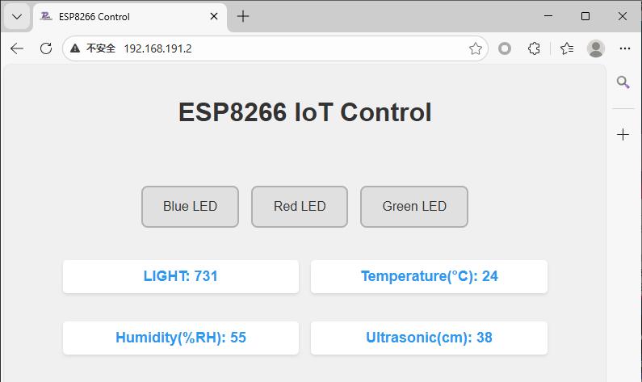

# 3.5.8 智能家居系统

## 3.5.8.1 简介

使用语音模块控制与WiFi局域网控制开灯，读取温度，湿度，光敏值，超声波测距值。

## 3.5.8.2 接线图

注意：UNO代码上传完毕后再将ESP-01S模块连接到UNO扩展板上，连接时注意ESP-01S模块接口的线序，GND对应黑色线，VCC对应红色线，不要接错！！！

## 3.5.8.3 ESP-01S 代码

请注意，你需要将SSID 名称与PASSWD 密码修改成你需要连接的WiFi的，并且这个WiFi需要是2.4GHz频段的。

## 3.5.8.4 UNO 代码

## 3.5.8.5 ESP-01S 代码说明

① 设置串口波特率为`750`，设置好要连接的wifi名称与wifi密码。

② 添加读取数据指令代码块

③ 添加读取温度，湿度，光敏值，超声波测距代码块

④ 添加红灯控制按键，绿灯控制按键，蓝灯控制按键

## 3.5.8.6 UNO 代码说明

① 设置好串口波特率为`750`，模拟串口波特率为`9600`，模拟串口引脚为RX：A5，TX：A4，设置接收数据变量，设置舵机初始化角度

② 判断语音模块是否通过模拟串口发送控制数据过来如果有就将控制数据赋值给变量`Voice_Control`

③ 搭建语音发送数据函数`Uart_SendCmd`

④ 判断WiFi模块是否通过串口发送控制数据过来，如果有就将控制数据赋值给变量给变量`WiFi_Control`，判断变量`WiFi_Control`重的数据是否等于`确认发送数据`指令，如果是就依次使用串口打印模块发送数据。

⑤ 使用逻辑或对语音控制模块的控制指令和wifi控制模块的指令进行判断，只要有一个条件满足就执行相应的功能代码（注意：每个WiFi控制的功能代码都要做一个应答否则将无法实现控制效果）

⑥ 判断语音模块发送过来的命令码发送对应的数据给语音模块，注意超过100的值发送给语音模块时需要将它换成百分比如下：

或者超过250的值直接就默认为0

## 3.5.8.7 代码结果

上传测试代码成功，你可以通过网页输入IP地址进入WiFi控制页面控制或通过语音模块进行控制。

语言模块控制方法：

**开红灯示例：** 你：“小智小智” ，小智：“我在”，你：“开红灯” 或 “打开红色灯” 或 “打开楼道灯”，小智：“已打开”

**关红灯示例：** 你：“小智小智” ，小智：“我在”，你：“关红灯” 或 “关闭红色灯” 或 “关闭楼道灯”，小智：“已关闭”

**开绿灯示例：** 你：“小智小智” ，小智：“我在”，你：“开绿灯” 或 “打开绿色灯” 或 “打开厨房灯”，小智：“已打开”

**关绿灯示例：** 你：“小智小智” ，小智：“我在”，你：“关绿灯” 或 “关闭绿色灯” 或 “关闭厨房灯”，小智：“已关闭”

**开蓝灯示例：** 你：“小智小智” ，小智：“我在”，你：“开蓝灯” 或 “打开蓝色灯” 或 “打开卧室灯”，小智：“已打开”

**关红蓝示例：** 你：“小智小智” ，小智：“我在”，你：“关蓝灯” 或 “关闭蓝色灯” 或 “关闭卧室灯”，小智：“已关闭”

**播报温度示例：** 你：“小智小智” ，小智：“我在”，你：“当前温度” 或 “现在温度是多少” ，小智：“当前温度是"温度值"摄氏度”

**播报湿度示例：** 你：“小智小智” ，小智：“我在”，你：“当前湿度” 或 “现在湿度是多少” ，小智：“当前湿度是百分之"湿度值"”

**播报光敏示例：** 你：“小智小智” ，小智：“我在”，你：“播报光敏值” 或 “当前亮度” ，小智：“当前亮度为百分之 “光敏值百分比”

**播报测距示例：** 你：“小智小智” ，小智：“我在”，你：“测距” 或 “距离多远” ，小智：“当前距离是 “距离值” 厘米”

