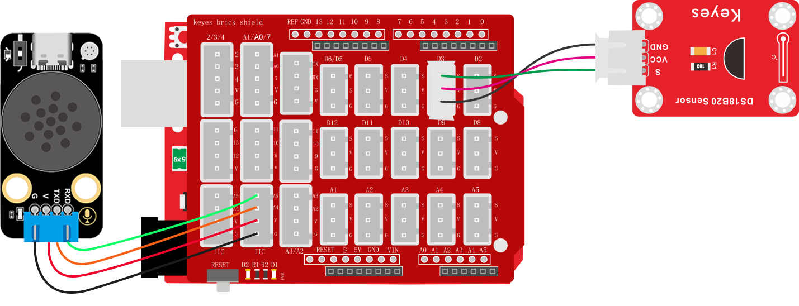
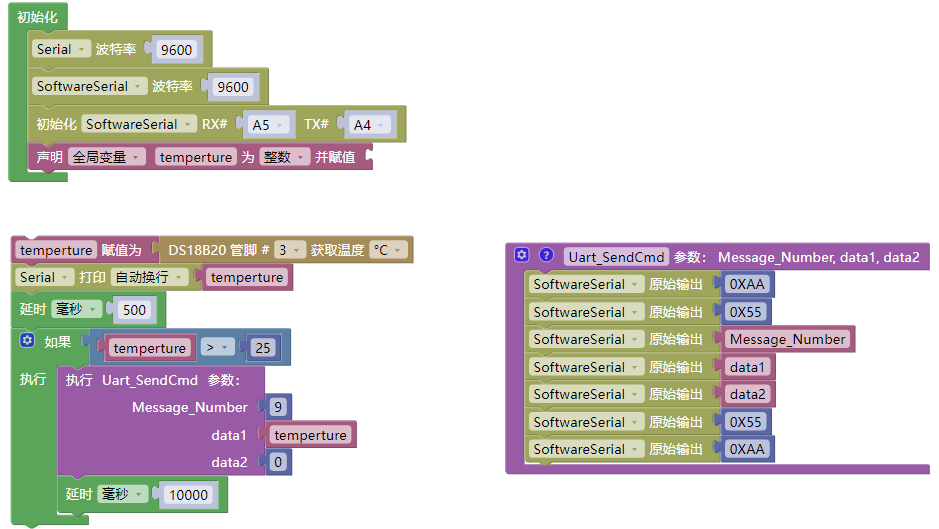
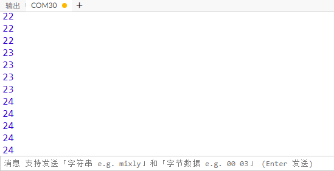

# 3.6.1 温度报警器

## 3.6.1.1 简介

当温度超过设置的阈值时，语音模块就会发出警告提示音 "警告，温度过高，当前温度是“xx”摄氏度"，在我们需要对温度预警时便能用到它了。

## 3.6.1.2 控制指令表

**消息号表：**

| 消息号 |               播报语音               |
| :----: | :----------------------------------: |
|   9    | 警告，温度过高，当前温度为“xx”摄氏度 |

## 3.6.1.3 接线图

## 3.6.1.4 代码

## 3.6.1.5 代码说明

① 设置串口以及模拟串口的波特率为`9600`，设置模拟串口引脚为RX：A5，TX：A4，设置全局变量`temperture`用于存放温度值

② 搭建发送消息号函数

③ 读取DS18B20温度数据并赋值给变量`temperture`，使用串口打印变量`temperture`方便监控温度数据，延时500毫秒

④ 使用判断模块对变量`temperture`中的温度值进行判断是否大于25，如果大于25就发送播报警告的消息号以及温度数据给语音模块，语音模块便会播报出“警告，温度过高，当前温度为"xx"摄氏度”，延时10s钟目的是在警报触发的时候每10秒才发出一次警告播报。（注意：温度值的是可以自行调节的你可以调节到你想要的温度值，当前温度值是方便课程实验现象展示）

## 3.6.1.6 代码结果

上传测试代码成功，打开串口查看打印的温度值，如果温度低于25摄氏度就可以用手握住加热使他高于25摄氏度，如果高于25摄氏度则可以调整温度值为高于你当前环境温度值2摄氏度的样子以便于你现象展示，课程代码当温度高于25摄氏度时，就会发出温度警报提示“警告，温度过高，当前温度是 xx 摄氏度”

