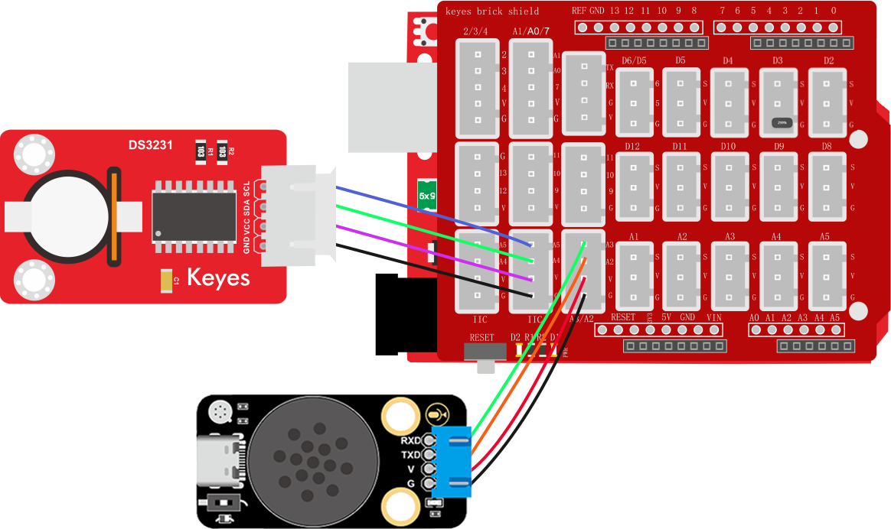
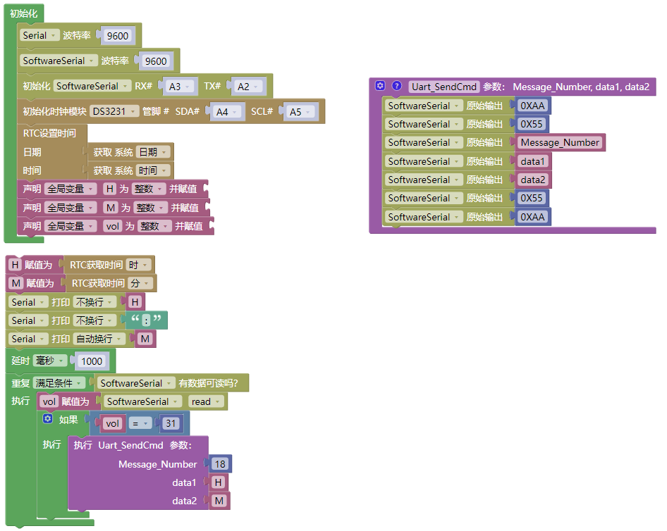

# 3.6.10 播报时间

## 3.6.10.1 简介

当你想知道时间单又不方便看时钟时，是不是在想喊一声有人能告诉你现在是几点了。本次课程就是教你如何使用时钟模块加语音模块制作出一个可以播报时间的装置，当你想知道现在是几点了你可以对着它喊"小智小智"等待它应答然后你就可以问他"几点了"或者"现在是几点"

## 3.6.10.2 控制指令表

**命令参数表：**

| 命令码 |          命令词          |   命令回复   |
| :----: | :----------------------: | :----------: |
|   31   | “几点了” 或 “现在是几点” | 正在读取时间 |

**消息号表：**

| 消息号 |      播报语音      |
| :----: | :----------------: |
|   18   | 现在是 xx 点 xx 分 |

## 3.6.10.3 接线图

请注意本课程的语音模块接线与前面课程不一样，需要调整一下位置以及代码接口否则将无法正常工作！！！

## 3.6.10.4 代码

## 3.6.10.5 代码说明

① 设置串口以及模拟串口的波特率为`9600`，设置模拟串口引脚为RX：A3，TX：A2（注意，语音模块模拟串口接口引脚变化！！）

② 添加初始化时钟模块并设置时钟为`DS3231`，并为它搭建获取系统时间代码块，设置全局变量`H`、`M`、`vol`用于存放时，分以及命令码的值

③ 搭建发送消息号函数以及读取模拟串口指令码代码

④ 如果有接收到语音模块的指令码则进行读取时间数据并将时数据赋值给变量`H`，分数据赋值给变量`M`，并通过串口打印时间这样就能直观的检查时间数据是否有误

⑤ 判断变量`vol`中的命令码是否等于`31`，如果是则发生消息号`18`以及data1（时钟），data2（分钟）数据给语音模块

## 3.6.10.6 代码结果

上传代码成功后，使用唤醒词“小智小智”唤醒小智语音模块，他会回答你“我在”然后你就可以使用命令词进行控制它了，如当前教程，我们就可以这样

**示例：** 你：“小智小智” ，小智：“我在”，你：“几点了” 或 “现在是几点” ，小智：“现在是 xx 点 xx 分”

