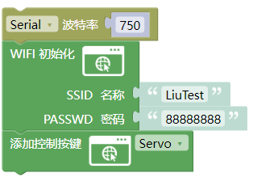
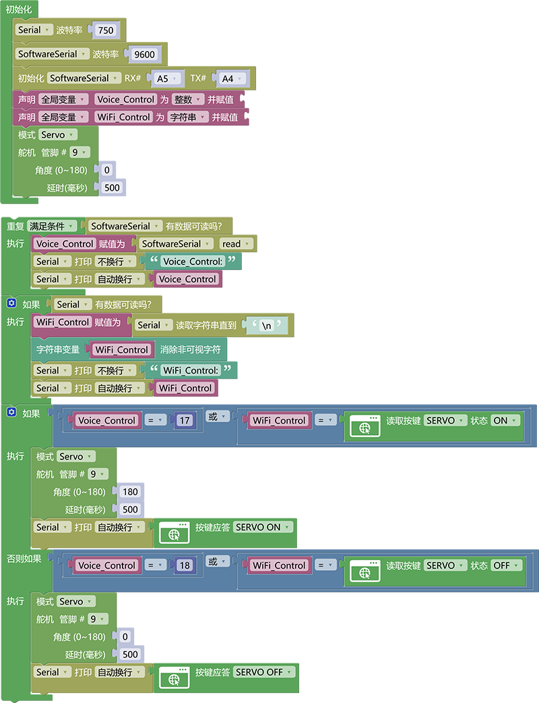

### 3.6.11 智能窗户控制

**1. 简介**

当你不想起身去关窗时你是不是在想喊一声通过语音控制或者通过手机控制窗户的开关。本次课程就是教你如何使用ESP-01S模块加语音模块控制舵机模拟出开关窗的动作。

**2. 控制指令表**

命令参数表：

| 命令码 |     命令词     | 命令回复 |
| :----: | :------------: | :------: |
|   17   | 打开舵机，开窗 |  已打开  |
|   18   | 关闭舵机，关窗 |  已关闭  |

**3. 接线图**

注意：UNO代码上传完毕后再将ESP-01S模块连接到UNO扩展板上，连接时注意ESP-01S模块接口的线序，GND对应黑色线，VCC对应红色线，不要接错！！！

**4. ESP-01S 代码**

请注意，你需要将SSID 名称与PASSWD 密码修改成你需要连接的WiFi的，并且这个WiFi需要是2.4GHz频段的。

**5. UNO代码**

**6. 代码说明**

①  设置好模拟串口波特率以及模拟串口波特率跟模拟串口引脚，添加全局变量整数类型名为`Voice_Control`，添加全局变量字符串类型名为`WiFi_Control`，初始化舵机到0度视为门为关闭状态。

② 读取模拟串口中语言模块发送的控制指令，并赋值给变量`Voice_Control`

③ 读取串口中ESP-01S模块发送的控制指令，并赋值给变量`WiFi_Control`

④ 使用判断模块判断变量`Voice_Control`等于`17`或者变量`WiFi_Control`等于`按键SERVO 状态为 ON`，如果条件满足舵机旋转到180度（开窗），串口打印按键SERVO ON应答。

④ 添加否则如果判断变量`Voice_Control`等于`18`或者变量`WiFi_Control`等于`按键SERVO 状态为 OFF`，如果条件满足舵机旋转到0度（关窗），串口打印按键SERVO OFF应答。

**7. 代码结果**

上传测试代码成功，你可以通过WiFi输入IP地址进入控制页面控制舵机旋转并且你也可以使用语言模块控制舵机打开以及关闭。

语言模块控制方法：

**开窗示例：** 你：“小智小智” ，小智：“我在”，你：“开窗” 或 “打开舵机” ，小智：“已打开”

**关窗示例：** 你：“小智小智” ，小智：“我在”，你：“关窗” 或 “关闭舵机” ，小智：“已关闭”
