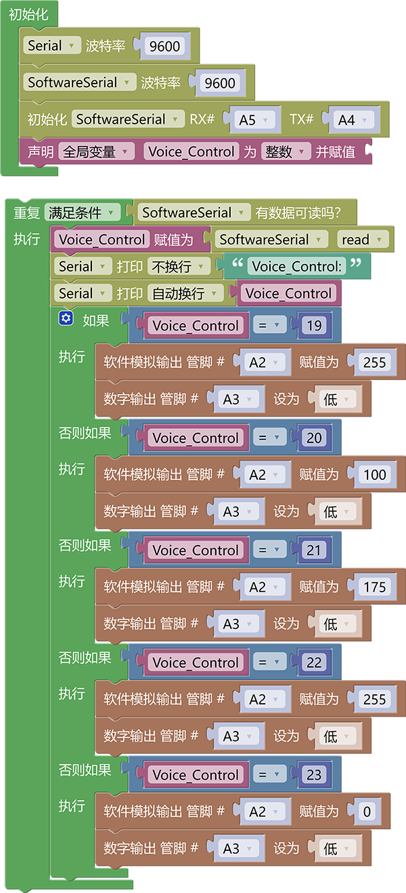

#    3.6.12 智能语音风扇

## 3.6.12.1 简介

如今市面上有很多的语音控制风扇，再也不像以前需要手动去调节风扇了，你只需要对着它喊出它的名称并告诉它你要它执行的命令就可以了，比如开风扇关风扇，一档，二档，三档等操作。本次课程我们就是基于语音模块做一个语音控制风扇模块的实验。

## 3.6.12.2 控制指令表

**命令参数表：**

| 命令码 |         命令词         |    命令回复    |
| :----: | :--------------------: | :------------: |
|   19   |        打开风扇        |   风扇已打开   |
|   20   | 风扇调到一档，风扇一档 | 风扇已调到一档 |
|   21   | 风扇调到二档，风扇二档 | 风扇已调到二档 |
|   22   | 风扇调到三档，风扇三档 | 风扇已调到三档 |
|   23   |        关闭风扇        |   风扇已关闭   |

## 3.6.12.3 接线图

## 3.6.12.4 代码

## 3.6.12.5 代码说明

① 设置串口以及模拟串口的波特率为`9600`，设置模拟串口引脚为RX：A5，TX：A4，设置全局变量`Voice_Control`用于存放语模块发送过来的命令码

② 搭建接收命令码代码并将命令码复制给变量`Voice_Control`

③ 对变量`Voice_Control`进行判断等于`19`为打开风扇，等于`20`为风扇一档，等于`21`为风扇二档，等于`22`为风扇三档，等于`23`为关闭风扇，因为我们需要对电机的转速进行控制，所有我们使用到了一个软件模拟输出的代码块，这个代码块是可以给没有PWM输出功能的引脚输出模拟PWM信号达到控制效果。

## 3.6.12.6 代码结果

上传代码成功后，使用唤醒词“小智小智”唤醒小智语音模块，他会回答你“我在”然后你就可以使用命令词进行控制它了，如当前教程，我们就可以这样

**打开风扇示例：** 你：“小智小智” ，小智：“我在”，你：“打开风扇” ，小智：“风扇已打开”

**风扇一档示例：** 你：“小智小智” ，小智：“我在”，你：“风扇调到一档” 或 “风扇一档” ，小智：“风扇已调到一档”

**风扇二档示例：** 你：“小智小智” ，小智：“我在”，你：“风扇调到二档” 或 “风扇二档” ，小智：“风扇已调到二档”

**风扇三档示例：** 你：“小智小智” ，小智：“我在”，你：“风扇调到三档” 或 “风扇三档” ，小智：“风扇已调到三档”

**关闭风扇示例：** 你：“小智小智” ，小智：“我在”，你：“关闭风扇”，小智：“风扇已关闭”