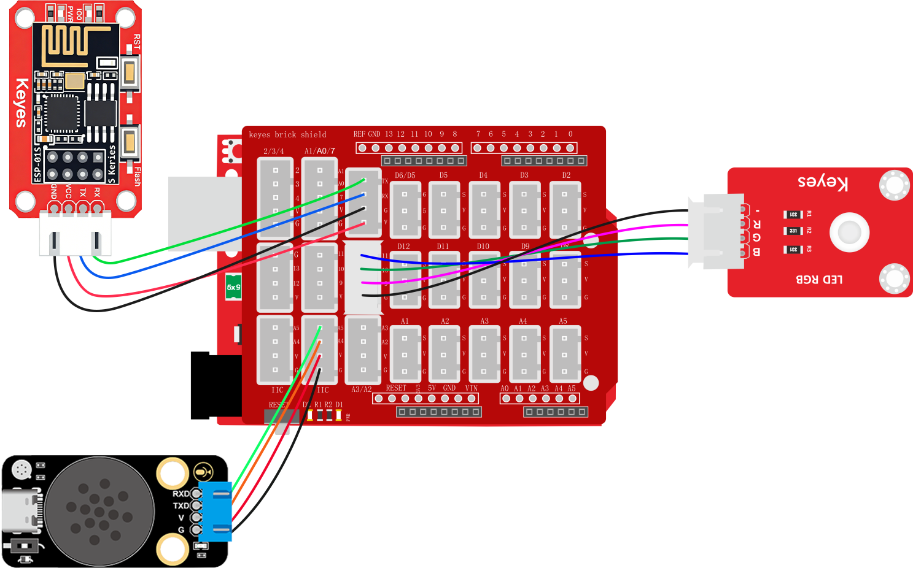
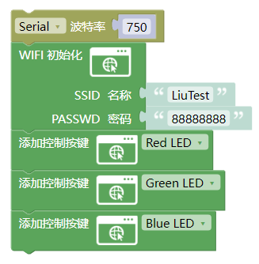
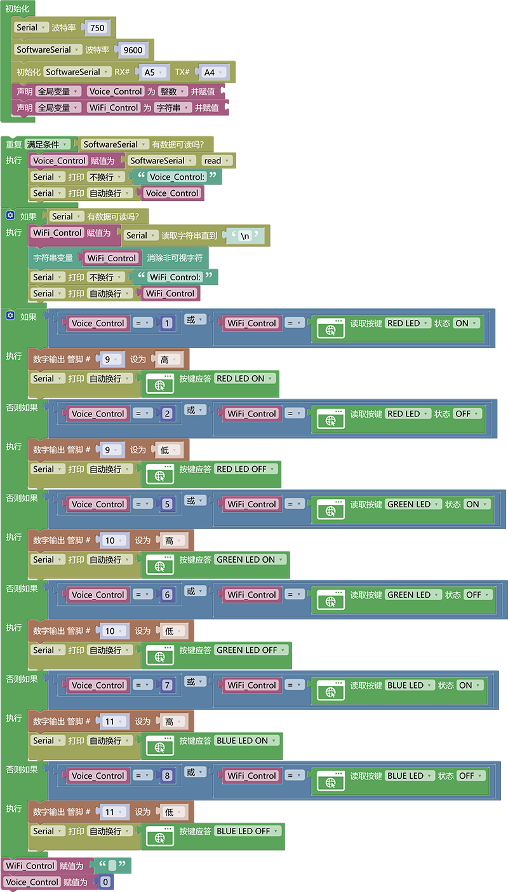

### 3.6.13 智能灯光系统

**1. 简介**

如果你不想起床关灯开灯时你是不是再想喊一声通过语音模块或者通过手机控制卧室灯，客厅灯，厨房灯，过道灯呢？本次课程就是教你如何使用ESP-01S模块加语音模块控制LED灯模拟家庭中你所需要开关的灯。

**2. 接线图**

注意：UNO代码上传完毕后再将ESP-01S模块连接到UNO扩展板上，连接时注意ESP-01S模块接口的线序，GND对应黑色线，VCC对应红色线，不要接错！！！

**3. ESP-01S 代码**

请注意，你需要将SSID 名称与PASSWD 密码修改成你需要连接的WiFi的，并且这个WiFi需要是2.4GHz频段的。

**4. UNO 代码**

**5. 代码说明**

代码逻辑与智能窗户控制类似。

**6. 代码结果**

上传测试代码成功，你可以通过WiFi输入IP地址进入控制页面控制LED灯点亮并且你也可以使用语言模块控制LED打开以及关闭。

语言模块控制方法：

**开红灯示例：** 你：“小智小智” ，小智：“我在”，你：“开红灯” 或 “打开红色灯” 或 “打开楼道灯”，小智：“已打开”

**关红灯示例：** 你：“小智小智” ，小智：“我在”，你：“关红灯” 或 “关闭红色灯” 或 “关闭楼道灯”，小智：“已关闭”

**开绿灯示例：** 你：“小智小智” ，小智：“我在”，你：“开绿灯” 或 “打开绿色灯” 或 “打开厨房灯”，小智：“已打开”

**关绿灯示例：** 你：“小智小智” ，小智：“我在”，你：“关绿灯” 或 “关闭绿色灯” 或 “关闭厨房灯”，小智：“已关闭”

**开蓝灯示例：** 你：“小智小智” ，小智：“我在”，你：“开蓝灯” 或 “打开蓝色灯” 或 “打开卧室灯”，小智：“已打开”

**关红蓝示例：** 你：“小智小智” ，小智：“我在”，你：“关蓝灯” 或 “关闭蓝色灯” 或 “关闭卧室灯”，小智：“已关闭”
