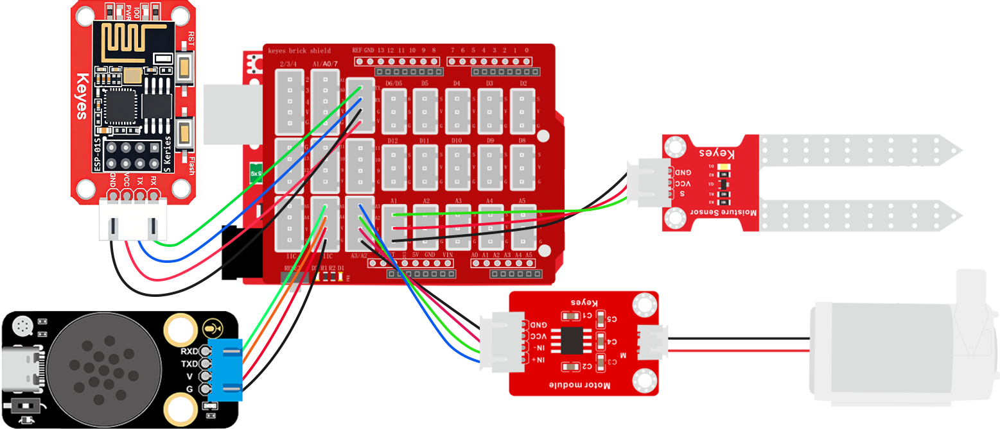
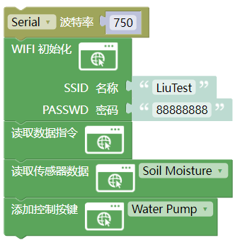
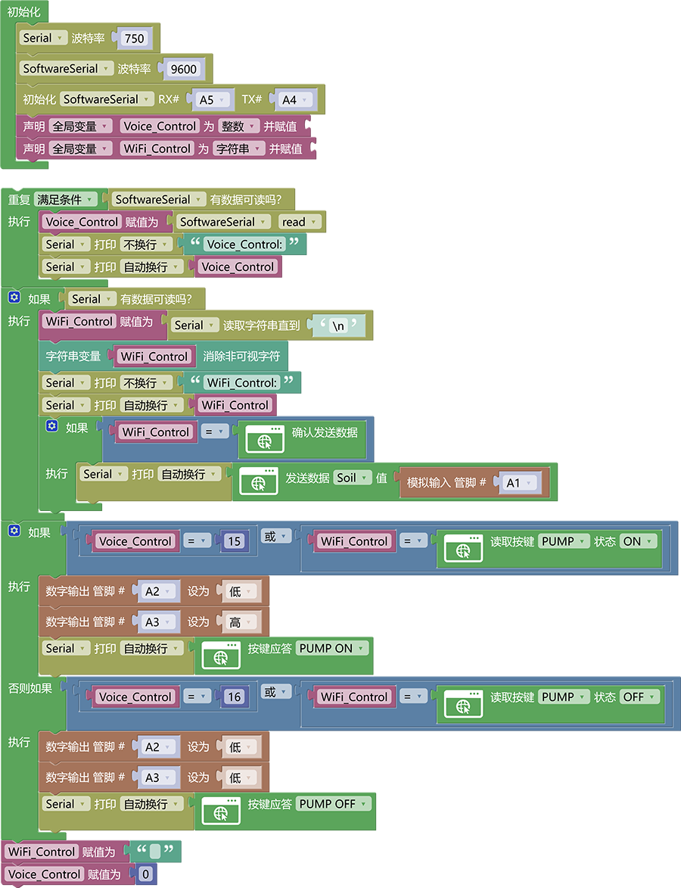
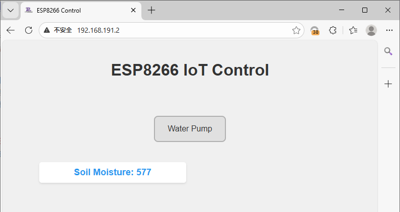

### 3.6.14 智能浇水系统

**1. 简介**

如果你不想手动去给盆栽浇水，你不是想通过手机无线控制或者语音控制一个装置浇水呢？本次课程就是教你如何使用ESP-01S模块加语音模块控制水泵进行浇水。

**2. 控制指令表**

命令参数表：

| 命令码 |       命令词       | 命令回复 |
| :----: | :----------------: | :------: |
|   15   |   打开水泵，浇水   |  已打开  |
|   16   | 关闭水泵，停止浇水 |  已关闭  |

**3. 接线图**

注意：UNO代码上传完毕后再将ESP-01S模块连接到UNO扩展板上，连接时注意ESP-01S模块接口的线序，GND对应黑色线，VCC对应红色线，不要接错！！！

**4. ESP01-S 代码**

请注意，你需要将SSID 名称与PASSWD 密码修改成你需要连接的WiFi的，并且这个WiFi需要是2.4GHz频段的。

**5. UNO 代码**

**6. 代码说明**

代码逻辑与智能窗户控制类似。

**7. 代码结果**

上传测试代码成功，你可以通过WiFi输入IP地址进入控制页面控制水泵并且你也可以使用语言模块控制水泵打开以及关闭。

语言模块控制方法：

**打开水泵示例：** 你：“小智小智” ，小智：“我在”，你：“打开水泵” 或 “浇水”，小智：“已打开”

**关闭水泵示例：** 你：“小智小智” ，小智：“我在”，你：“关闭水泵” 或 “停止浇水”，小智：“已关闭”

