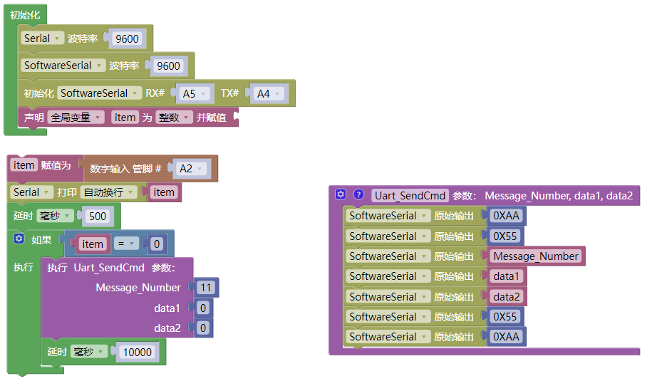

# 3.6.3 烟雾报警器

## 3.6.3.1 简介

当烟雾传感器检测到烟雾时，语音模块就会发出警告提示音“警告，检测到烟雾，请快速撤离”。

## 3.6.3.2 控制指令表

**消息号表：**

| 消息号 |           播报语音           |
| :----: | :--------------------------: |
|   11   | 警告，检测到烟雾，请快速撤离 |

## 3.6.3.3 接线图

## 3.6.3.4 代码

## 3.6.3.5 代码说明

① 设置串口以及模拟串口的波特率为`9600`，设置模拟串口引脚为RX：A5，TX：A4，设置全局变量`item`用于存放烟雾传感器的状态值

② 搭建发送消息号函数

③ 读取碰撞模块状态值并赋值给变量`item`，使用串口打印变量`item`方便监烟雾传感器的数据，延时500毫秒

④ 使用判断模块对变量`item`的值进行判断如果等于`0`则发送播报烟雾警报的消息号`11`给语音模块，语音模块根据消息号匹配是语音进行播报

⑤ 延时10秒钟，让播报声有间隔

## 3.6.3.6 代码结果

上传测试代码成功，打开串口查看打印的烟雾传感器的状态值，如果烟雾传安全检测到烟雾便会发出警告提示声“警告，检测到烟雾，请快速撤离”。