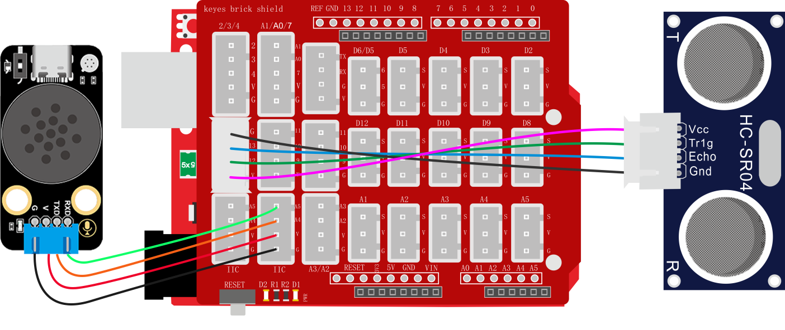
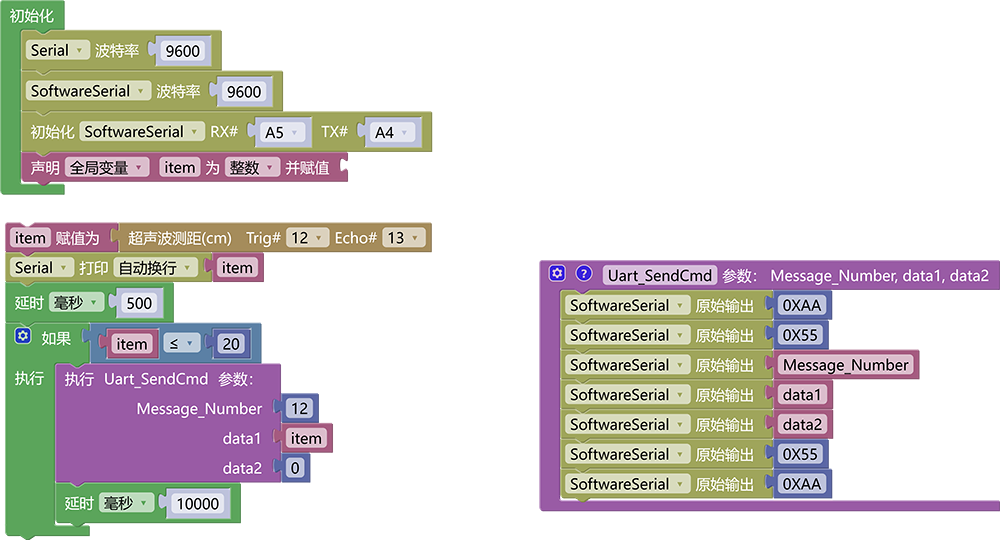

# 3.6.4 距离报警器

## 3.6.4.1 简介

当超声波传感器检测到距离低于我们设置的阈值时，语音模块就会发出警告提示音“警告，xx 厘米后发生碰撞”。

## 3.6.4.2 控制指令表

**消息号表：**

| 消息号 |        播报语音         |
| :----: | :---------------------: |
|   12   | 警告，xx 厘米后发生碰撞 |

## 3.6.4.3 接线图

## 3.6.4.4 代码

## 3.6.4.5 代码说明

代码逻辑与温度报警类似

## 3.6.4.6 代码结果

上传测试代码成功，打开串口查看打印的距离值，如果距离大于20CM语音模块不会发出报警，如果低于或等于20CM时语音模块就会播报报警声“警告，xx 厘米后发生碰撞”每十秒播报一次。

