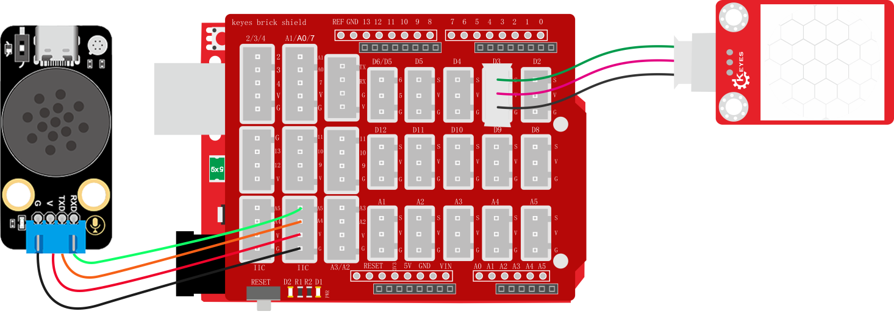

### 3.6.6 闯入报警器

**1. 简介**

当人体红外传感器感应到有人靠近时，语音模块就会发出警告提示音“警告，非法闯入，请立即离开”

**2. 控制指令表**

消息号表：

| 消息号 |          播报语音          |
| :----: | :------------------------: |
|   14   | 警告，非法闯入，请立即离开 |

**3. 接线图**

**4. 代码**

**5. 代码结果**

上传测试代码成功，打开串口查看打印的人体红外感器状态值，如果人体红外传感器检测到了附近有人则会报警“警告，非法闯入，请立即离开”