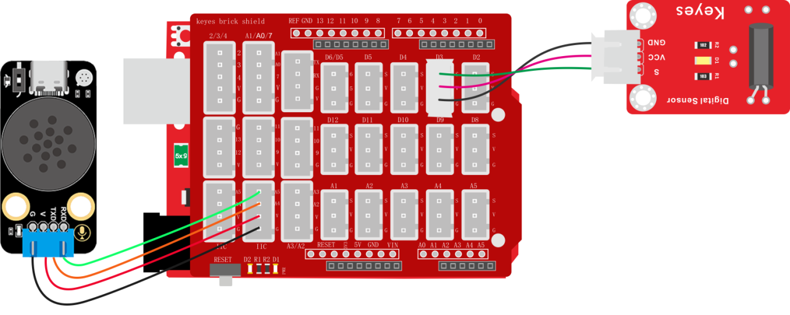
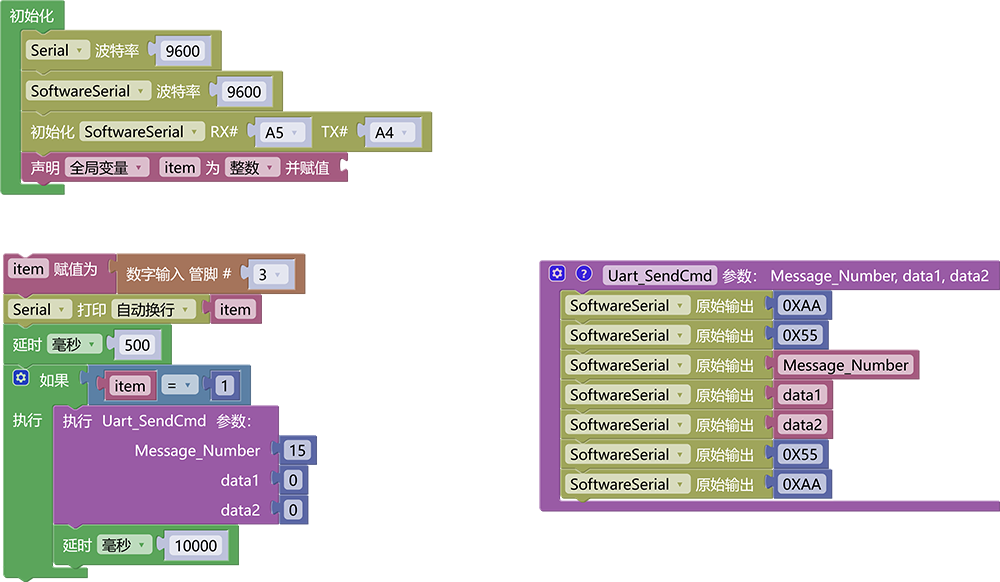

### 3.6.7 震动报警器

**1. 简介**

当震动传感器感应到震动时，语音模块就会发出警告提示音“警告，发生震动请前往空旷地”

**2. 控制指令表**

消息号表：

| 消息号 |          播报语音          |
| :----: | :------------------------: |
|   15   | 警告，发生震动请前往空旷地 |

**3. 接线图**

**4. 代码**

**5. 代码结果**

上传测试代码成功，打开串口查看打印的震动传感器状态值，如果震动传感器检测到了震动则会报警“警告，发生震动请前往空旷地”