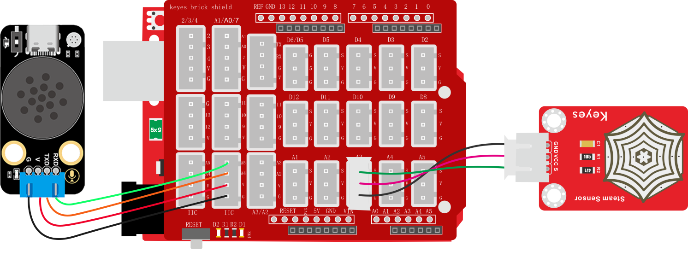
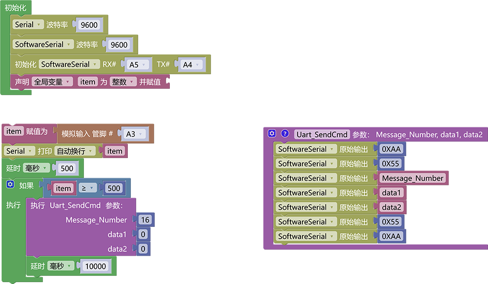

### 3.6.8 下雨报警器

**1. 简介**

当水滴传感器感应到雨水时，语音模块就会发出警告提示音“下雨了，快收衣服”

**2. 控制指令表**

**消息号表：**

| 消息号 |    播报语音    |
| :----: | :------------: |
|   16   | 下雨了快收衣服 |

**3. 接线图**

**4. 代码**

**5. 代码结果**

上传测试代码成功，打开串口查看打印的水滴传感器模拟值，如果水滴传感器检测到了雨水则会报警“下雨了，快收衣服”