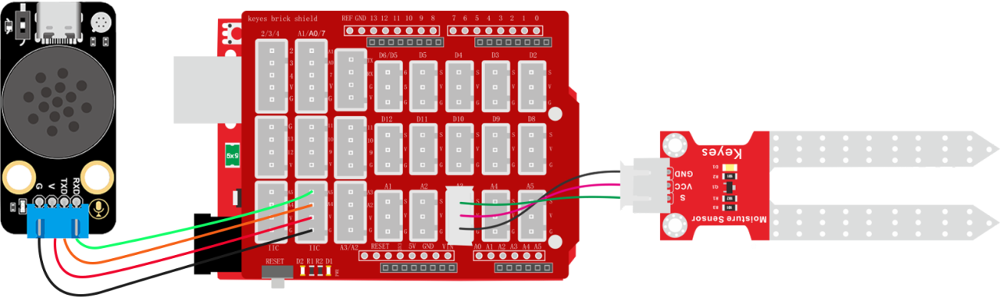
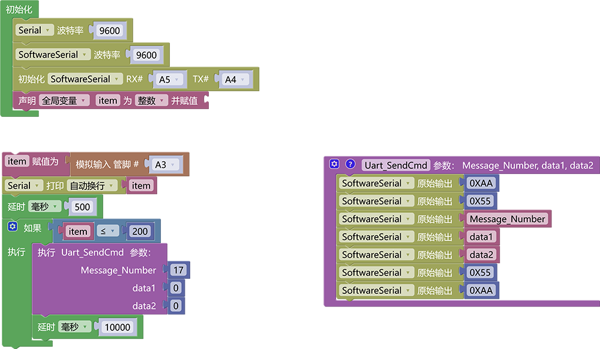

# 3.6.9 土壤湿度报警器

## 3.6.9.1 简介

当土壤湿度传感器感应到花盆的土壤湿度低于设置的阈值时，语音模块就会发出警告提示音“请注意花盆土壤湿度过低，请尽快浇水”

## 3.6.9.2 控制指令表

**消息号表：**

| 消息号 |              播报语音              |
| :----: | :--------------------------------: |
|   17   | 请注意花盆土壤湿度过低，请尽快浇水 |

## 3.6.9.3 接线图

## 3.6.9.4 代码

## 3.6.9.5 代码结果

上传测试代码成功，打开串口查看打印的土壤湿度传感器模拟值，如果土壤湿度传感器检测到湿度模拟值低于我们设置的阈值则会报警“请注意花盆土壤湿度过低，请尽快浇水”