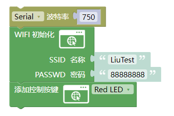
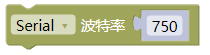
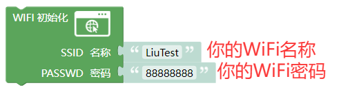
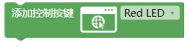
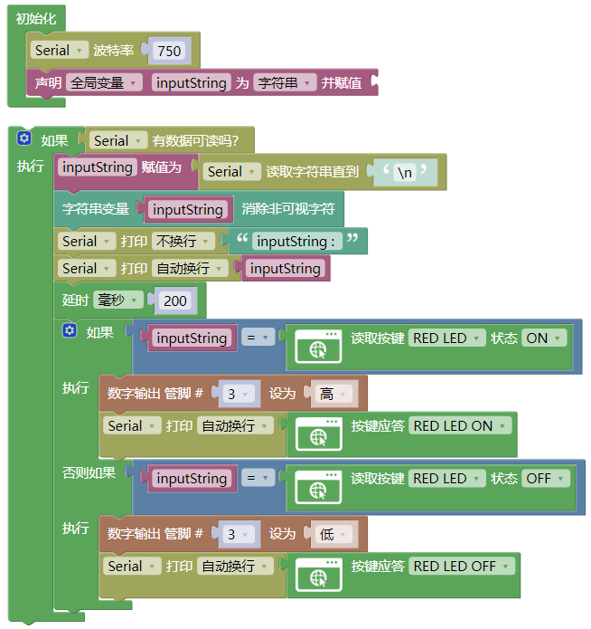
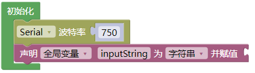
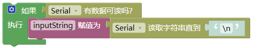
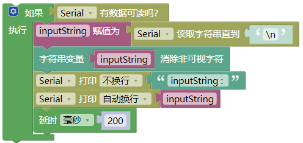
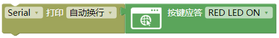
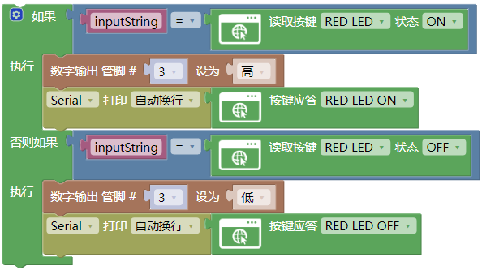

### 3.2.2 WiFi控制LED灯

**1.  简介**

使用ESP-01S模块实现对UNO开发板上的LED灯进行WiFi无线控制打开与关闭的功能。课程为基础WiFi控制教程，其他的执行类的模块控制方式都与本课程一样，如舵机、电机等等...

**2. 接线图**

注意：UNO代码上传完毕后再将ESP-01S模块连接到UNO扩展板上，连接时注意ESP-01S模块接口的线序，GND对应黑色线，VCC对应红色线，不要接错！！！

**3. ESP-01S代码**

请注意，你需要将SSID 名称与PASSWD 密码修改成你需要连接的WiFi的，并且这个WiFi需要是2.4GHz频段的。

**4. ESP-01S 代码说明**

① 设置串口波特率为`750`注意：波特率需要慢一点不能太快，数据传输太快容易丢失数据！！建议波特率为“750”

② 在库中托出WiFi初始化模块，并设置好要连接的WiFi名称与密码。

③ 添加网页按键功能并根据需要选择对应的按键名称，课程我们直接选择Red LED即可

**5. UNO 代码**

注意：串口波特率一定要与ESP8266的波特率匹配，波特率为“750”。还有上传代码时开发板不要连接ESP-01S模块否则会上传失败！！

**6. UNO代码说明**

① 设置串口波特率为`750`，这个串口是用来打印接收数据的，方便查看是否有接收到ESP-01S模块数据

② 添加一个全局变量，名称为`inputString` ，类型为`String`

③ 使用判断模块判断是否有数据从串口发送过来

④ 使用变量`inputString`读取串口的数据并直到`\n`

⑤ 使用文本栏中的消除非可见数据模块，消除变量`inputString`多余的无用的数据 ，使用串口打印变量`inputString`，并延时200ms

⑥ 使用判断模块对变量`inputString`进行判断是否等于对应按键名称以及状态，栏中模块设置按键为`RED LED` ，状态为`ON`，设置D3引脚输出高电平

⑦ 设置按键应答，这一步很重要，目的是告诉ESP-01S模块 UNO开发板通过串口接收到的指令数据是正确的。按键应答程序很简单，只需要使用串口打印模块然后再加中的按键应答模块并设置好对应的应答内容，如：RED LED ON 或者 RED LED OFF 等等...

⑧ 点击判断模块的按键，添加一个`否则如果`，再添加一个判断按键`RED LED`状态为`OFF`的代码块然后再下方设置D3引脚输出为低电平。（注意：每个按键状态都匹配一个按键应答选项，需要选择匹配的应答选项否则将无法实现WiFi控制功能)

**7. 代码结果**

分别将ESP-01S与UNO开发板的代码上传成功后，将ESP-01S连接到UART口。按一下“ESP-01S Arduino wifi转串口扩展板”上的`RST`按键使ESP-01S模块复位重新连接WiFi并通过UNO开发板的串口打印IP地址，然后再连接同一个wifi设备的浏览器中输入IP搜索进入网页控制页面。

