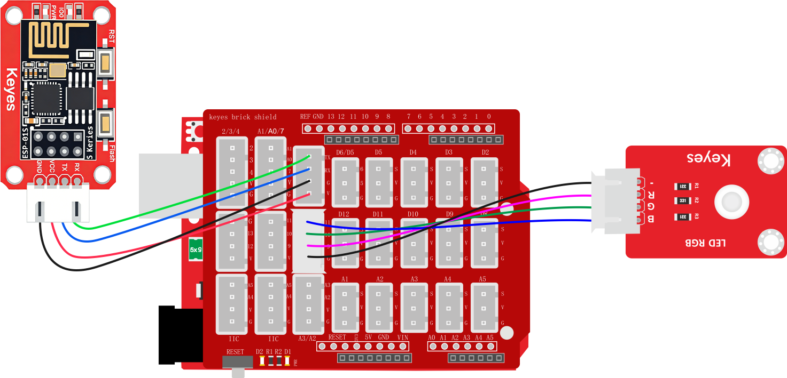
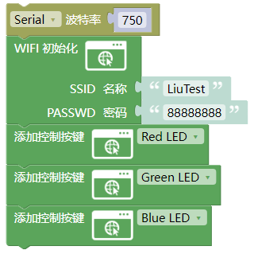
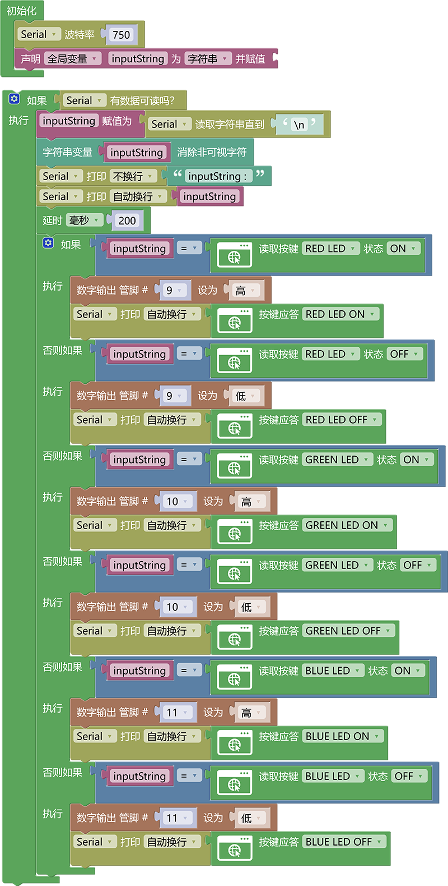
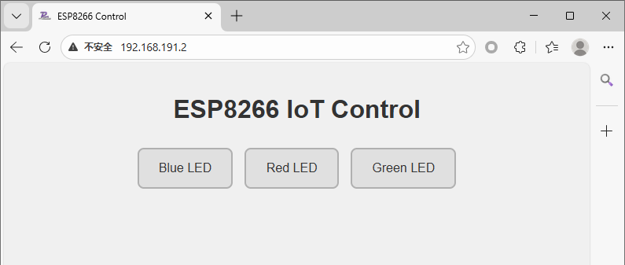

# 3.2.3 wifi控制多个led灯

## 3.2.3.1 简介

前面我们学习了如何使用WiFi控制单个LED灯的亮灭，那么如果是多个LED灯或者别的执行器呢？本节课程将会告诉你如何控制个led灯。

## 3.2.3.2 接线

注意：UNO代码上传完毕后再将ESP-01S模块连接到UNO扩展板上，连接时注意ESP-01S模块接口的线序，GND对应黑色线，VCC对应红色线，不要接错！！！

## 3.2.3.3 ESP-01S 代码

注意：波特率需要慢一点不能太快，因为数据传输太快容易丢失数据！！建议波特率为“750”

请注意，你需要将SSID 名称与PASSWD 密码修改成你需要连接的WiFi的，并且这个WiFi需要是2.4GHz频段的。

## 3.2.3.4 ESP-01S 代码说明

① 按照控制单个LED灯的逻辑搭建好ESP-01S基本代码

② 分别添加名称为`Red LED`，`Green LED`，`Blue LED`三种按键的代码块这样就搭建好三个按键的网页控制代码了。

## 3.2.3.5 UNO 代码

注意：串口波特率一定要与ESP8266的波特率匹配。波特率为“750”

## 3.2.3.6 UNO代码说明

① 同理也是与控制单个LED的代码逻辑一样，添加判断模块对每个按键对应的状态进行判断并再对应的状态下添加功能代码达到控制效果。

## 3.2.3.7 代码结果

分别将ESP-01S与UNO开发板的代码上传成功后，将ESP-01S连接到UART口。按一下“ESP-01S Arduino wifi转串口扩展板”上的`RST`按键使ESP-01S模块复位重新连接WiFi并通过UNO开发板的串口打印IP地址，然后再连接同一个wifi设备的浏览器中输入IP搜索进入网页控制页面。

