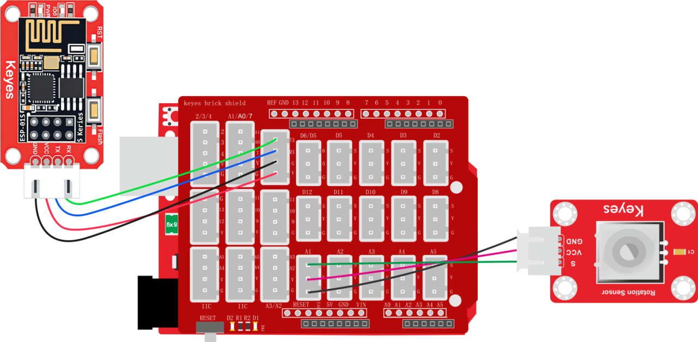
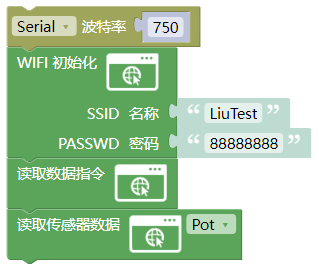
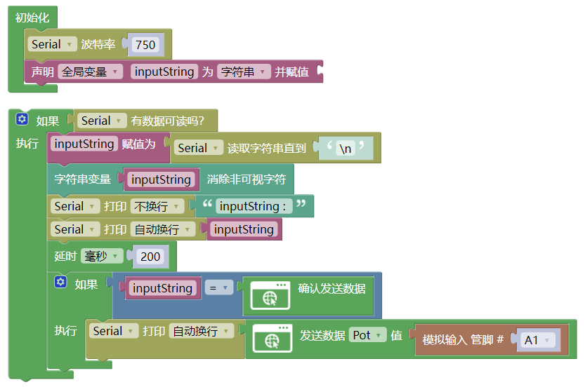
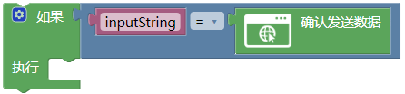
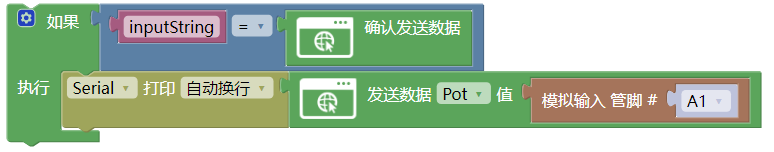
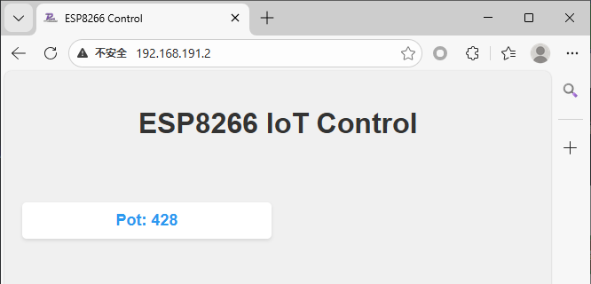

# 3.2.4 wifi读取电位器模拟值

## 3.2.4.1 简介

使用ESP-01S模块实现对UNO开发板连接的传感器数据进行WiFi无线读取并显示在网页上。课程为基础WiFi读取数据教程，其他传感器的数据读取方式与本课程一样，如DHT11的温度与湿度、光敏传感器、超声波测距等等...

## 3.2.4.2 接线

注意：UNO代码上传完毕后再将ESP-01S模块连接到UNO扩展板上，连接时注意ESP-01S模块接口的线序，GND对应黑色线，VCC对应红色线，不要接错！！！

## 3.2.4.3 ESP-01S 代码

注意：波特率需要慢一点不能太快，因为数据传输太快容易丢失数据！！建议波特率为“750”

请注意，你需要将SSID 名称与PASSWD 密码修改成你需要连接的WiFi的，并且这个WiFi需要是2.4GHz频段的。

## 3.2.4.4 ESP-01S 代码说明

① 前面的基础框架与WiFi控制的代码一样

② 添加读取数据指令模块，添加了这个模块就会向UNO发送读取数据的指令，UNO接收到读取数据指令后就会发送传感器数据过来

③ 在库中托出读取传感器数据模块，并设置需要读取的传感器这里我们选择`Pot`

## 3.2.4.5 UNO 代码

注意：串口波特率一定要与ESP8266的波特率匹配。波特率为“750”

## 3.2.4.6 UNO代码说明

① 前面的基础框架与WiFi控制的代码一样，区别就在后面的读取数据代码块上

② 添加判断模块判断是否接收到ESP-01S模块发送的字符`SENSOR_READ`，如果是就使用串口打印代码块发送数据给ESP-01S模块

③ 添加发送数据代码块选择对应的传感器名称，这里我们选择`Pot`电位器，然后将读取模拟输入代码块添加到数据区域并设置读取引脚为`A1`。

## 3.2.4.7 代码结果

分别将ESP-01S与UNO开发板的代码上传成功后，将ESP-01S连接到UART。按一下“ESP-01S Arduino wifi转串口扩展板”上的`RST`按键使ESP-01S模块复位重新连接WiFi并通过UNO开发板的串口打印IP地址，然后再连接同一个wifi设备的浏览器中输入IP搜索进入网页控制页面。

