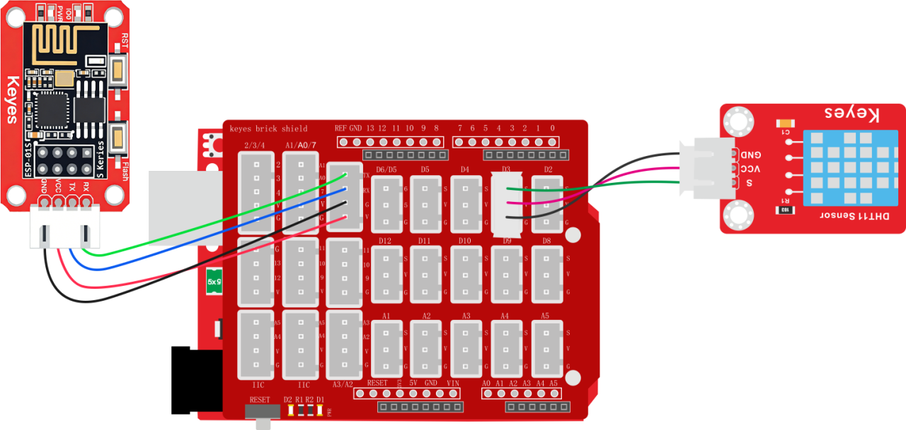
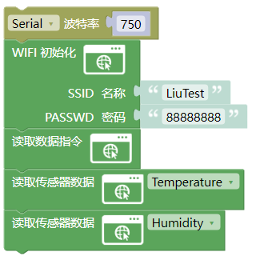
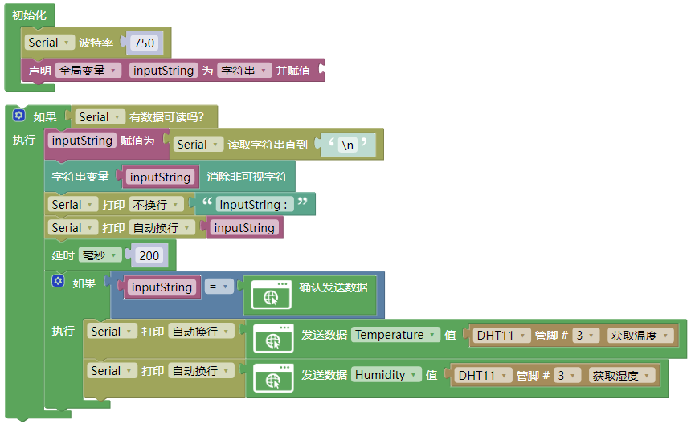
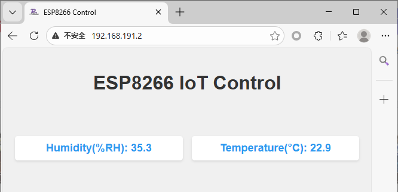

# 3.2.5 WiFi读取温度与湿度

## 3.2.5.1 简介

前面我们学习了如何读取单个数据，那么如果有两个数据了呢？其实跟单个数据一样只需要添加对应数据发送的代码块然后添加数据即可。如下我们读取温度以及湿度。

## 3.2.5.2 接线

注意：UNO代码上传完毕后再将ESP-01S模块连接到UNO扩展板上，连接时注意ESP-01S模块接口的线序，GND对应黑色线，VCC对应红色线，不要接错！！！

## 3.2.5.3 ESP-01S 代码

注意：波特率需要慢一点不能太快，因为数据传输太快容易丢失数据！！建议波特率为“750”

请注意，你需要将SSID 名称与PASSWD 密码修改成你需要连接的WiFi的，并且这个WiFi需要是2.4GHz频段的。

## 3.2.5.4 ESP-01S 代码说明

① 代码逻辑与读取电位器值的代码一致，只是需要多加一个数据的读取代码块

## 3.2.5.5 UNO 代码

注意：串口波特率一定要与ESP8266的波特率匹配。波特率为“750”

## 3.2.5.6 UNO代码说明

① 代码逻辑与读取电位器值的代码一致，只是需要多加一个发送数据的代码块

## 3.2.5.7 代码结果

分别将ESP-01S与UNO开发板的代码上传成功后，将ESP-01S连接到UART口。按一下“ESP-01S Arduino wifi转串口扩展板”上的`RST`按键使ESP-01S模块复位重新连接WiFi并通过UNO开发板的串口打印IP地址，然后再连接同一个wifi设备的浏览器中输入IP搜索进入网页控制页面。

