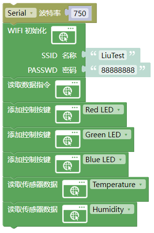
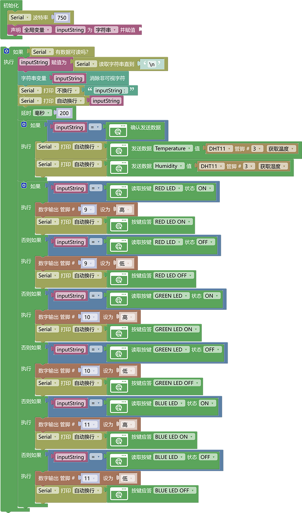

# 3.2.6 wifi控制系统

## 3.2.6.1 简介

我们学会了如何使用ESP-01S模块控制LED灯，也学了如何使用ESP-01S模块读取数据，那么接下来我们将他们控制与读取数据集合到一起做一个示例，我们将控制RGB灯的三个LED灯的亮灭，并且还要显示温度与湿度在控制页面上。

## 3.2.6.2 接线

注意：UNO代码上传完毕后再将ESP-01S模块连接到UNO扩展板上，连接时注意ESP-01S模块接口的线序，GND对应黑色线，VCC对应红色线，不要接错！！！

## 3.2.6.3 ESP-01S 代码

注意：波特率需要慢一点不能太快，因为数据传输太快容易丢失数据！！建议波特率为“750”

请注意，你需要将SSID 名称与PASSWD 密码修改成你需要连接的WiFi的，并且这个WiFi需要是2.4GHz频段的。

## 3.2.6.4 ESP-01S 代码说明

① 基础代码都是一样的

② 添加三个按键的代码块`Red LED`、`Green LED`、`Blue LED`

③ 添加读取传感器数据代码块分别读取温度`Temperature`，湿度`Humidity`

## 3.2.6.5 UNO 代码

注意：串口波特率一定要与ESP8266的波特率匹配。波特率为“750”

## 3.2.6.6 UNO代码说明

① 基础代码都是一样的

② 使用判断模块判断`inputString`的值是否是ESP-01S发送过来的发送传感器数据指令，如果是就对数据进行逐个发送，我们需要发送温度与湿度的数据

③ 使用判断模块对ESP-01S发送过来的按键控制指令进行判断指令与按键名称以及当前的状态匹配就执行下方的代码

## 3.2.6.7 代码结果

分别将ESP-01S与UNO开发板的代码上传成功后，将ESP-01S连接到UART口。按一下“ESP-01S Arduino wifi转串口扩展板”上的`RST`按键使ESP-01S模块复位重新连接WiFi并通过UNO开发板的串口打印IP地址，然后再连接同一个wifi设备的浏览器中输入IP搜索进入网页控制页面。

点击按键即可控制led灯的亮灭，并且温度与湿度的数据也会实时刷新再页面中。

