### 3.2.1 wifi控制基础

**1. 简介**

我们知道UNO开发板是没有WiFi功能的，那么我们就只能借助WiFi模块来实现WiFi控制的功能。课程中我们使用ESP8266串口WIFI ESP-01S模块，它是一款超低功耗的UART-WiFi 透传模块，拥有业内极富竞争力的封装尺寸和超低能耗技术，专为移动设备和物联网应用设计，可将用户的物理设备连接到Wi-Fi 无线网络上，进行互联网或局域网通信，实现联网功能。

注意：ESP-01S的串口与UNO开发板的模拟串口的波特率必须是`750`，原因是UNO开发板的模拟串口使用太快的波特率容易丢失接收与发送的数据。

**2. 所需模块**

|                    名称                    | 数量 |             图片              |
| :----------------------------------------: | :--: | :---------------------------: |
| Keyes USB转ESP-01S WIFI模块串口测试扩展板  |  1   |  |
| keyes brick ESP-01S Arduino wifi转串口扩展 |  1   | 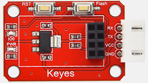 |
|                ESP-01S模块                 |  1   | 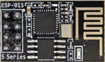 |
|       4P 双头XH2.54插头 VCC-GND反向        |  1   |   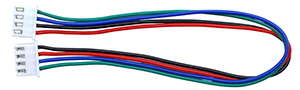   |

**3. ESP-01S模块参数**

- 支持无线802.11 b/g/n 标准
- 支持STA/AP/STA+AP 三种工作模式

- 内置TCP/IP协议栈，支持多路TCP Client连接 

- 支持丰富的Socket AT指令

- 支持UART/GPIO数据通信接口

- 支持Smart Link 智能联网功能

- 支持远程固件升级（OTA）

- 内置32位MCU，可兼作应用处理器 

- 超低能耗，高集成度的 Wi-Fi 芯片，适合电池供电应用

- 超宽工作温度范围：0°C 至 +60°C

- 3.3V 单电源供电

**4. 如何给ESP-01S模块烧录代码**

① 将ESP8266串口WIFI ESP-01S模块正确方向插入USB转ESP-01S WIFI模块串口测试扩展板上。

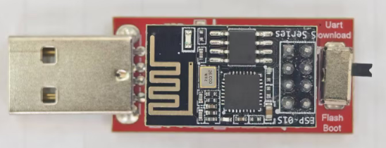

② 先将USB转ESP-01S WIFI模块串口测试扩展板上的拨码开关拨到UartDownload端，再将USB转ESP-01S WIFI模块串口测试扩展板插入电脑的USB口。

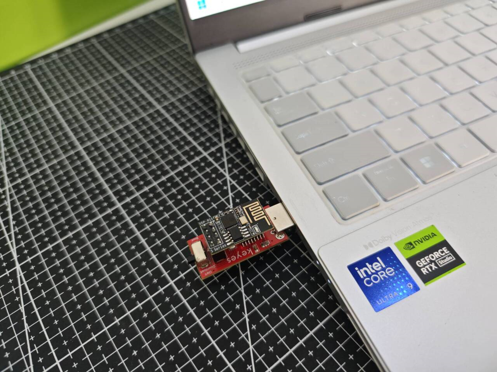

③ 打开Mixly 3.0 版本并找到ESP8266开发板点击进入编程页面。

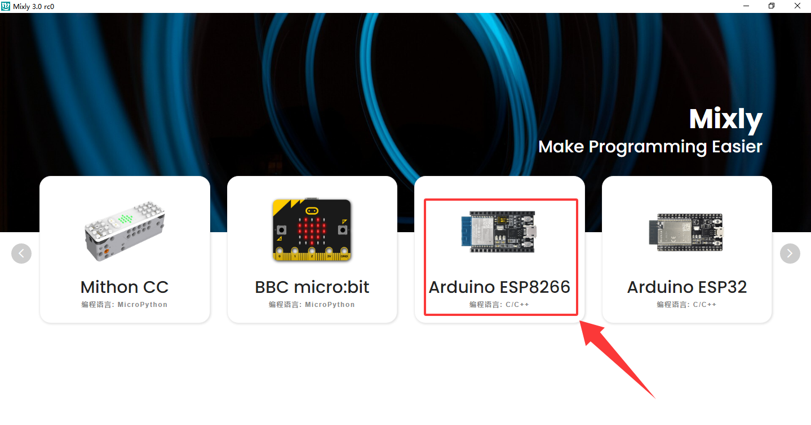

④ 添加库文件，点击Mixly页面右上角的`设置`-->`库管理`再点击`导入库`右侧的 找到下载好的`file`文件夹并进入`库文件`夹中选择`index.xml`库文件。

一定要添加库文件否则代码将报错！！！

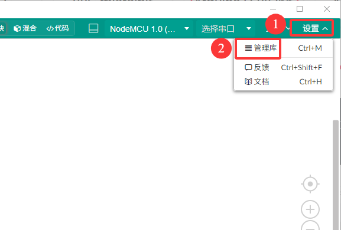

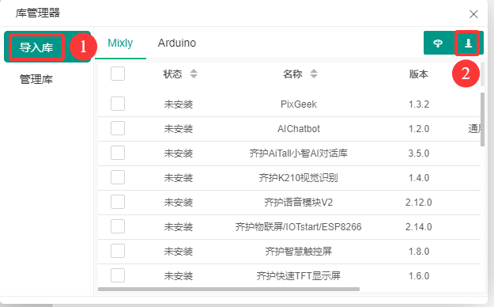

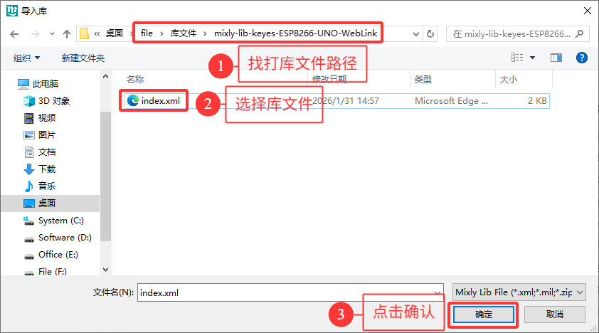

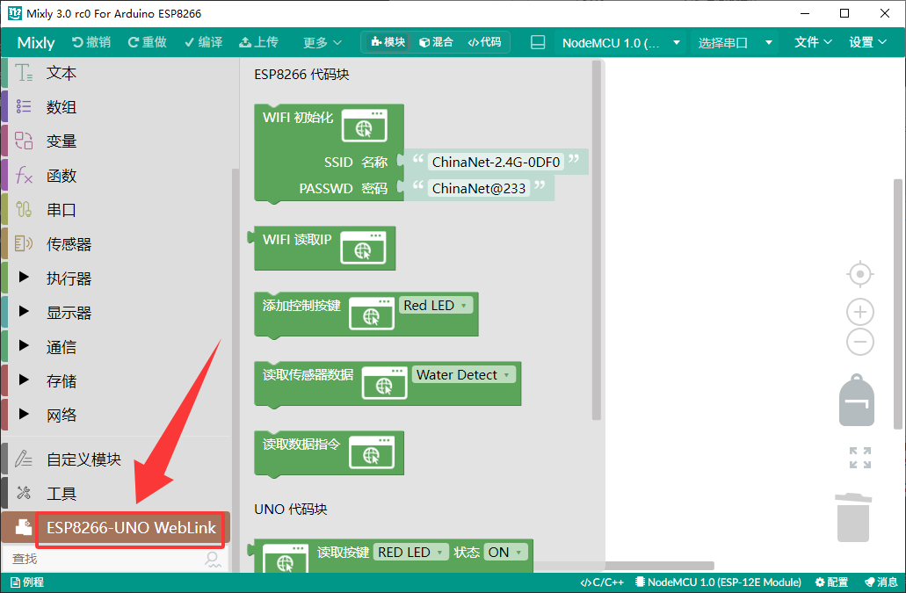

⑤ 打开我们提供的代码文件，这里我们以“3.2.1 控制LED灯代码”为例：打开课程代码文件中的`ESP-01S代码`文件中的代码文件“控制LED灯ESP01-S代码.mix” 

注意：你需要将WiFi的SSID名称改成你的WiFi名称还有你的WiFi密码，并且你的wifi频率必须是2.4GHz的否则ESP-01S将连接不上wifi。

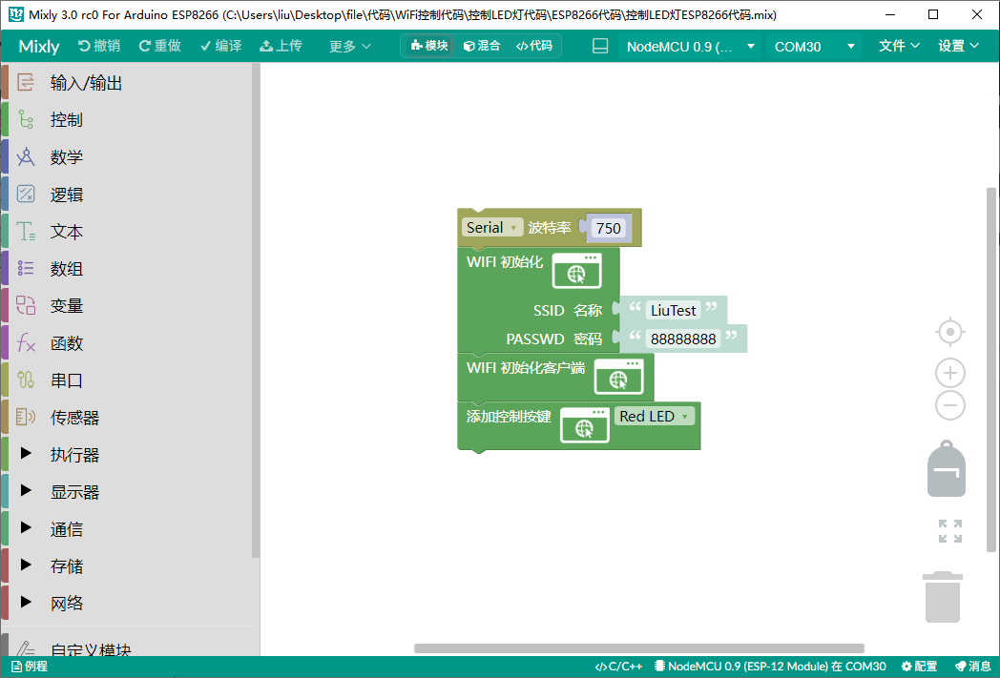

⑥ 打开代码文件后选择正确的USB转ESP-01S WIFI模块端口号点击上传即可。

**5. UNO与ESP-01S模块的通信**

① 打开Mixly 3.0 版本找到UNO开发板点击进入编程页面。

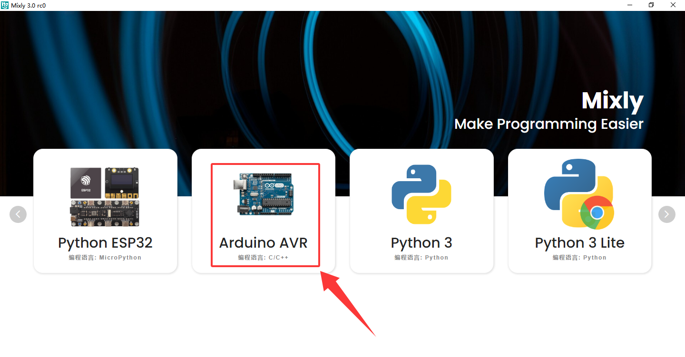

② ESP-01S模块烧录了代码后我们将为UNO烧录匹配控制的代码，我们依旧以“3.2.1 控制LED灯代码”为例：打开课程代码文件中的`UNO代码`文件中的代码文件“控制LED灯UNO代码.mix”

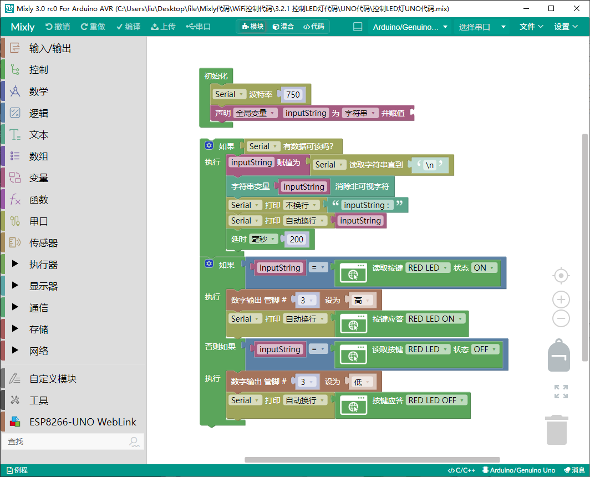

③ 使用ESP-01S Arduino wifi转串口扩展板将ESP-01S模块连接到UNO开发板上的 |V|G|RX|TX| 口 ，将LED灯模块接到D3口。

注意：使用连接线的接口方向，接错了可能会烧坏模块的！！！

|    ESP-01S    |   UNO扩展包    |
| :-----------: | :------------: |
| GND（黑色线） | VCC （红色线） |
| VCC（红色线） | GND （黑色线） |
| TX （蓝色线） | RX （蓝色线）  |
|  RX (绿色线)  | TX （绿色线）  |

**ESP-01S 正确接线图：**（注意线的颜色顺序）

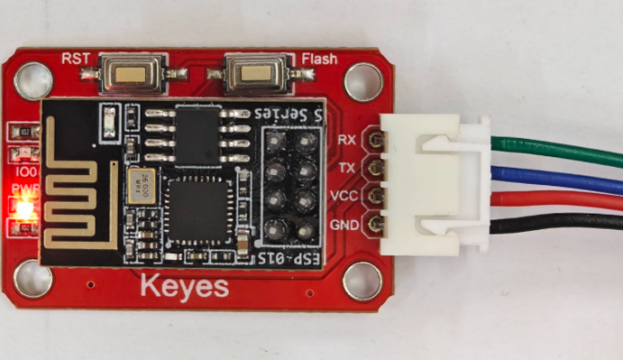

**UNO 扩展包正确接线图：**（注意线的颜色顺序）

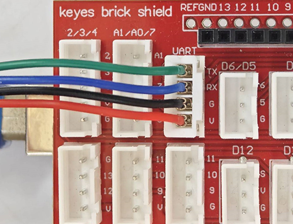

④打开UNO开发板的串口，并按“ESP-01S Arduino wifi转串口扩展板”上的`RST`按键使ESP-01S模块复位重新连接WiFi并打印IP地址

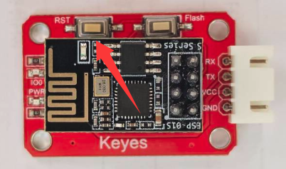

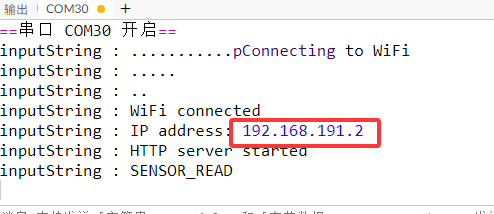

⑤ 使用电脑或者手机平板连接ESP-01S模块连接的WiFi，然后在浏览器中输入IP地址我的是`192.168.191.2`你的需要看串口打印中的，便能进入控制网页了。注意：必须与ESP-01S模块连接同一个wifi才能进入控制页面。

发送按键控制指令时，UNO开发板会有一个应答的程序，如果没有应答就会默认数据发送失败。当你按下按键时会出现

`Sending:RED_LED:1` ：表示发送指令“RED_LED:1”

`Success:RED_LED:1` ：表示发送指令“RED_LED:1” 成功

`Network error` ：表示发送指令失败

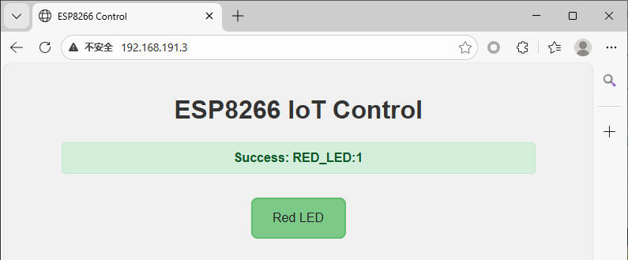

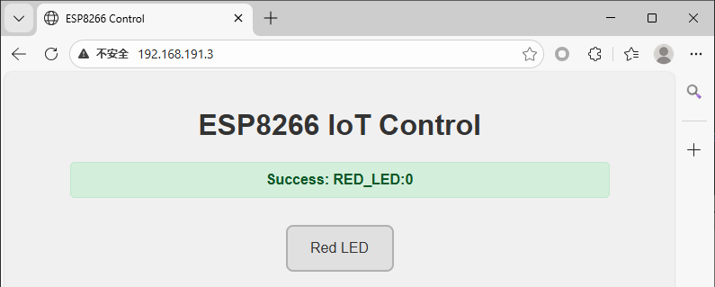

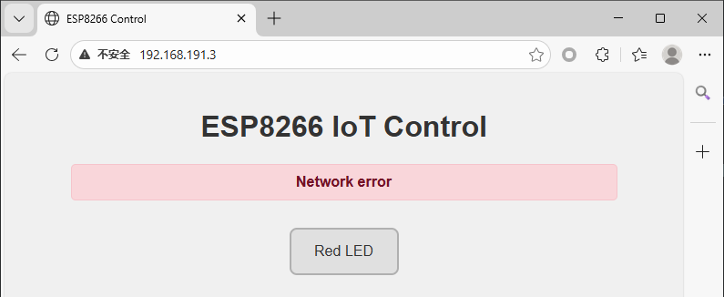

⑥ 点击按键即可远程控制LED灯的亮灭了。

