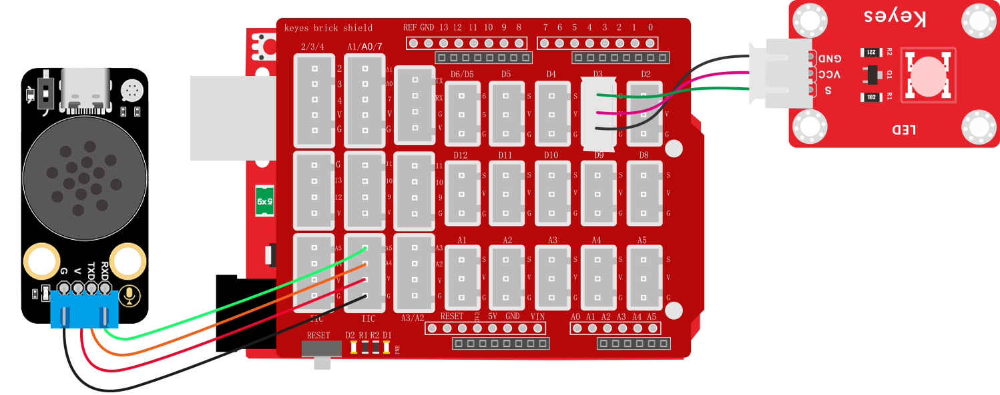
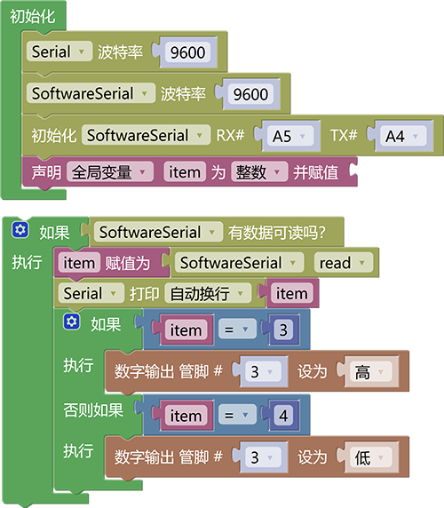
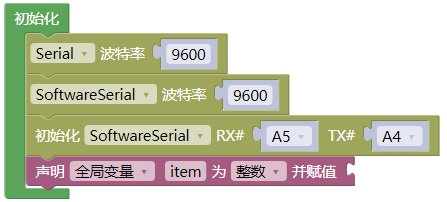
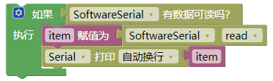
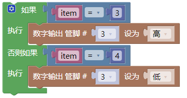

### 3.3.2 语音控制开灯

**1. 简介**

使用小智语音模块接收到的语音指令控制UNO板连接的LED灯，我们可以将LED灯设置成卧室，厨房，阳台等。用户只需说出“打开客厅灯”或“关闭客厅灯”等指令，系统便能快速响应，实现精准的本地化控制。该方案不仅提供了便捷的交互体验，也为后续集成更多智能设备（如风扇、窗户）奠定了坚实基础，是迈向全屋智能的低成本入门实践。

**2. 控制指令表**

| 命令码 |          命令词          | 命令回复 |
| :----: | :----------------------: | :------: |
|   3    | 开白灯，开灯，打开客厅灯 |  已打开  |
|   4    | 关白灯，关灯，关闭客厅灯 |  已关闭  |

**3. 接线图**

**4. 代码**

**5. 代码说明**

① 设置串口（Serial）波特率与模拟串口（SoftwareSerial）波特率为`9600`，设置模拟串口引脚为RX：A5，TX：A4，声明一个整数型变量`item`用来存放模拟串口发送过来的数据

② 使用判断模块判断模拟串口中是否有数据发送过来，如果有数据发送过来就读取数据并将数据赋值给变量`item`，使用串口换行打印变量`item`的值（只能使用串口打印模拟串口不行）方便观察接收到的指令值

③ 对变量`item`进行判断（从控制指令表中可知指令码）我想要语音喊开灯与关灯控制led灯的亮灭，对照控制指令表，开灯的指令码为：`3`，关灯的指令码为：`4`，所以我们就使用判断模块进行判断如果变量`item`等于3则控制led灯亮，否则如果`item`等于4则led灯熄灭。

**6. 代码结果**

上传代码成功后，使用唤醒词“小智小智”唤醒小智语音模块，他会回答你“我在”然后你就可以使用命令词进行控制它了，如当我们教程是开灯教程，我们就可以这样.

**开灯示例：** 你：“小智小智” ，小智：“我在”，你：“开灯” 或 “开白灯” 或 “打开客厅灯”，小智：“已打开”

**关灯示例：** 你：“小智小智” ，小智：“我在”，你：“关灯” 或 “关白灯” 或 “关闭客厅灯”，小智：“已关闭”

