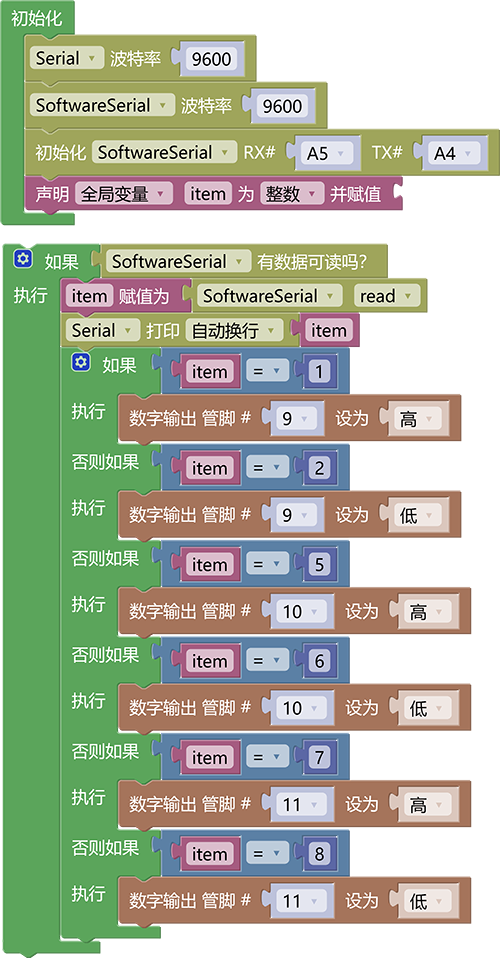

# 3.3.3 语音控制多个灯

## 3.3.3.1 简介

前面我们学习了，如何使用小智语音模块控制一个LED灯，那么现在我们将他扩展成控制多个LED灯。

## 3.3.3.2 控制指令表

| 命令码 |             命令词             | 命令回复 |
| :----: | :----------------------------: | :------: |
|   1    | 开红灯，打开红色灯，打开楼道灯 |  已打开  |
|   2    | 关红灯，关闭红色灯，关闭楼道灯 |  已关闭  |
|   5    | 开绿灯，打开绿色灯，打开厨房灯 |  已打开  |
|   6    | 关绿灯，关闭绿色灯，关闭厨房灯 |  已关闭  |
|   7    | 开蓝灯，打开蓝色灯，打开卧室灯 |  已打开  |
|   8    | 关蓝灯，关闭蓝色灯，关闭卧室灯 |  已关闭  |
|        |                                |          |

## 3.3.3.3 接线图

## 3.3.3.4 代码

## 3.3.3.5 代码说明

① 代码逻辑总体与控制一个LED灯是一样的，只是对应不同的灯有着不一样的指令码，需要对应指令码表格进行编写，其实就是语音模块识别我们的指令后它会通过模拟串口发送指令到开发板，开发板接受执行然后通过对指令码的判断执行相应的功能即可。

## 3.3.3.6 代码结果

上传代码成功后，使用唤醒词“小智小智”唤醒小智语音模块，他会回答你“我在”然后你就可以使用命令词进行控制它了，如当前教程，我们就可以这样

**开红灯示例：** 你：“小智小智” ，小智：“我在”，你：“开红灯” 或 “打开红色灯” 或 “打开楼道灯”，小智：“已打开”

**关红灯示例：** 你：“小智小智” ，小智：“我在”，你：“关红灯” 或 “关闭红色灯” 或 “关闭楼道灯”，小智：“已关闭”

**开绿灯示例：** 你：“小智小智” ，小智：“我在”，你：“开绿灯” 或 “打开绿色灯” 或 “打开厨房灯”，小智：“已打开”

**关绿灯示例：** 你：“小智小智” ，小智：“我在”，你：“关绿灯” 或 “关闭绿色灯” 或 “关闭厨房灯”，小智：“已关闭”

**开蓝灯示例：** 你：“小智小智” ，小智：“我在”，你：“开蓝灯” 或 “打开蓝色灯” 或 “打开卧室灯”，小智：“已打开”

**关红蓝示例：** 你：“小智小智” ，小智：“我在”，你：“关蓝灯” 或 “关闭蓝色灯” 或 “关闭卧室灯”，小智：“已关闭”

