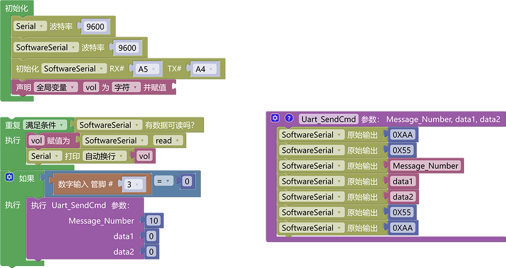
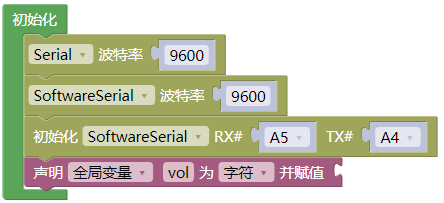
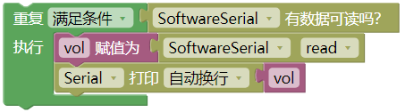
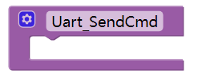
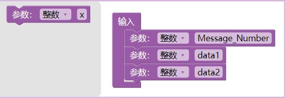
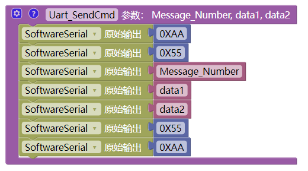
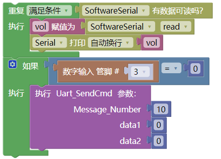

# 3.3.4 语音播报倾斜

## 3.3.4.1 简介

使用小智语音模块语音控制读取UNO开发板连接的传感器的值，我们先使用一个简单语音控制读取的功能熟悉一下代码以及逻辑。以便后面的课程理解。

## 3.3.4.2 控制指令表

接收到UNO开发板发送过来的消息号，语音模块便会播出设置好的语音。

| 消息号 | 播放语音     |
| :----: | ------------ |
|   10   | 警告发生倾斜 |
|        |              |

## 3.3.4.3 接线图

## 3.3.4.4 代码

## 3.3.4.5 代码说明

① 设置串口波特率为`9600`，这个串口是用来打印语音模块发送过来的指令的方便判断是否有指令发送过来

② 设置接收语音模块发出数据的模拟串口引脚为RX：A5，TX：A4，并设置模拟串口波特率为`9600`

③ 添加一个全局变量，名称为`vol` ，类型为`char`

④ 使用判断模块判断是否有数据从模拟串口发送过来，如果有就将数据读取并赋值给变量`vol`，使用串口将变量`vol`打印出来

⑤ 搭建发送消息号到语音模块的函数，首先从栏中托出模块，并修改名称为“Uart_SendCmd”

⑥ 点击添加函数输入参数，第一个参数为整数类型名称为`Message_Number`（是用来存放需要发送消息号的)，第二个参数为整数类型名称为`data1`（是用来存放需要发送的数据的)，第三个参数为整数类型名称为`data2`（也是用来存放需要发送的数据的，与data1不同的是，如果消息号对应一个数据那就data2为0即可，如果对应两个数据就启用data2，如时钟需要数据时，数据分的时候就要用到两个数据位)

⑦ 在"Uart_SendCmd"函数中添加发送消息号以及数据的代码，使用模拟串口发送原始数据给语音模块，数据格式为：`0XAA 0X55 Message_Number data1 data2 0X55 0XAA`，所以我们代码就是使用模拟串口发送模块对这些数据逐个输出即可，如图：

⑧ 使用判断模块对倾斜传感器的数字信号进行判断如果等于0，就发送消息号让语音模块播报倾斜警告的语音，播报倾斜警告语音的消息号为`10`

## 3.3.4.6 代码结果

上传代码成功后，将倾斜模块向一遍倾斜如果倾斜传感器返回的数字信号为0，则语音模块就回发出"警告，发生倾斜"

