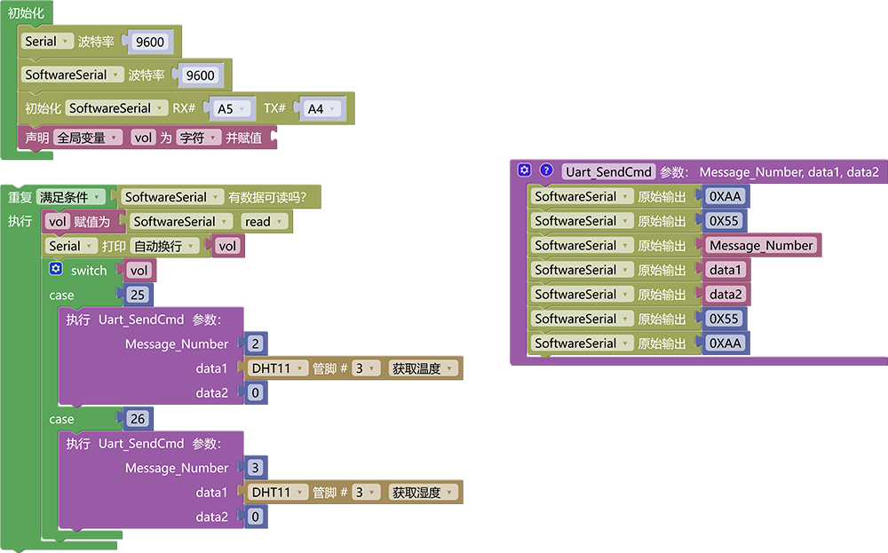
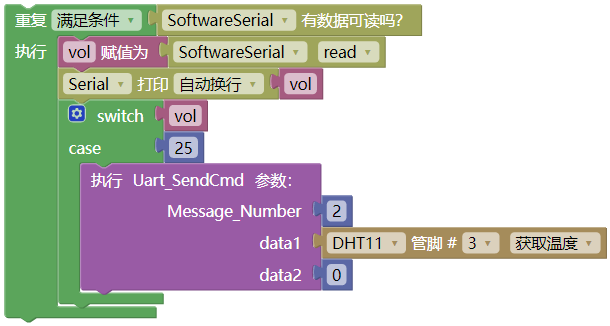
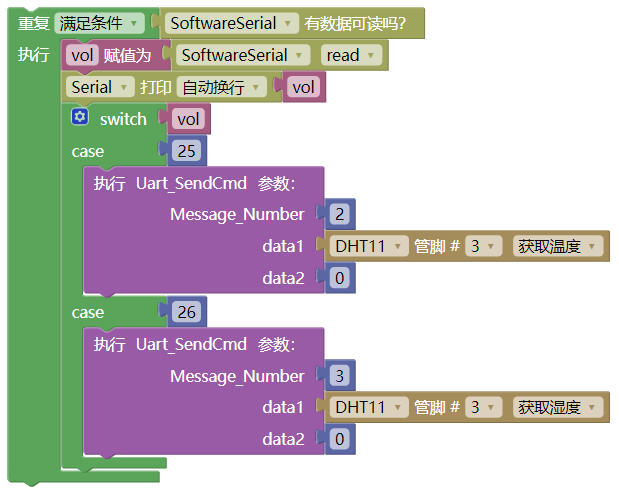

# 3.3.5 语音播报温度与湿度

## 3.3.5.1 简介

我们学会了发送消息号给语音模块从而控制它播报对应的声音，那么接下来我们要学习发送消息号以及传感器数据给语音模块，让语音模块播报出语音+传感器数据，如：当前温度是 二十五摄氏度 或 当前湿度是百分之 五十 等等...

## 3.3.5.2 控制指令表

**命令参数表：**

| 命令码 |             命令词             |     命令回复     |
| :----: | :----------------------------: | :--------------: |
|   25   | “当前温度” 或 “现在温度是多少” | 正在读取环境温度 |
|   26   | “当前湿度” 或 “现在湿度是多少” | 正在读取环境湿度 |

**消息号表：**

| 消息号 |          播报语音          |
| :----: | :------------------------: |
|   2    | 当前温度是 “温度值” 摄氏度 |
|   3    | 当前湿度是百分之 “湿度值”  |

## 3.3.5.3 接线图

## 3.3.5.4 代码

## 3.3.5.5 代码说明

① 基本代码语播报倾斜课程一致，不在重复

② 当我们唤醒语音模块并询问他"当前温度"，语音模块就会发送一个命令码`25`过来，然后通过判断这个命令码执行发送温度消息号以及数据给语音模块，我们使用`switch`代码块来实现，这个代码块语判断代码块功能类似，就是判断导入的变量是否与`case`后方的变量一致，如果是就执行下方的代码。

注意：`switch`中case后面的`25`是读取温度的命令码可以对照表格寻找 ；函数`Uart_SendCmd`中参数`Message_Number`是消息号可以对照表格寻找 ；参数`data1`是温度数据 ；参数`data2`是空值所以是0

③ 我们使用同样的方法搭建出播报湿度的代码

## 3.3.5.6 代码结果

上传代码成功后，使用唤醒词“小智小智”唤醒小智语音模块，他会回答你“我在”然后你就可以使用命令词进行控制它了，如当前教程，我们就可以这样

**播报温度示例：** 你：“小智小智” ，小智：“我在”，你：“当前温度” 或 “现在温度是多少” ，小智：“当前温度是"温度值"摄氏度”

**播报湿度示例：** 你：“小智小智” ，小智：“我在”，你：“当前湿度” 或 “现在湿度是多少” ，小智：“当前湿度是百分之"湿度值"”

