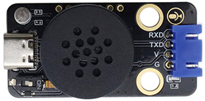
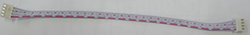
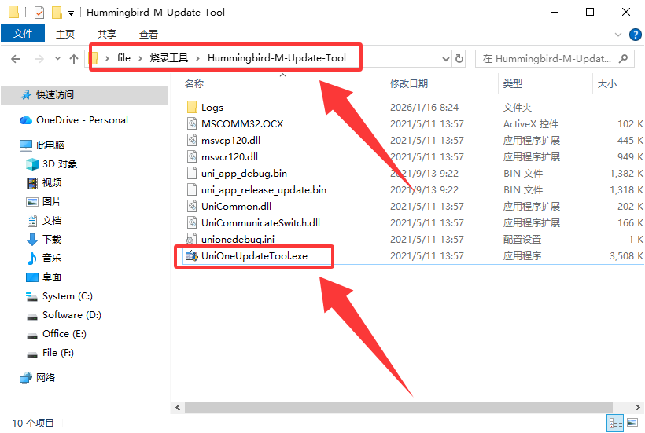
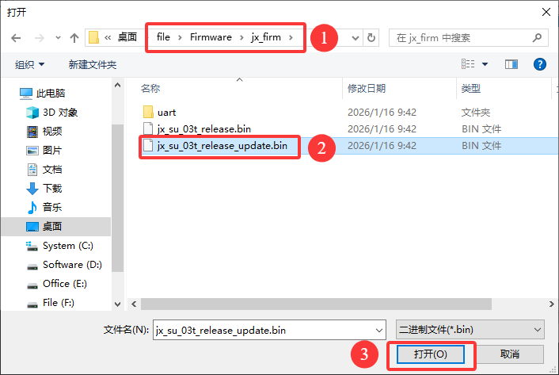
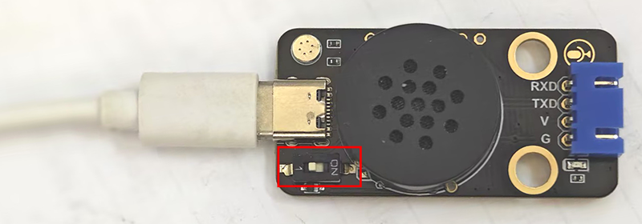
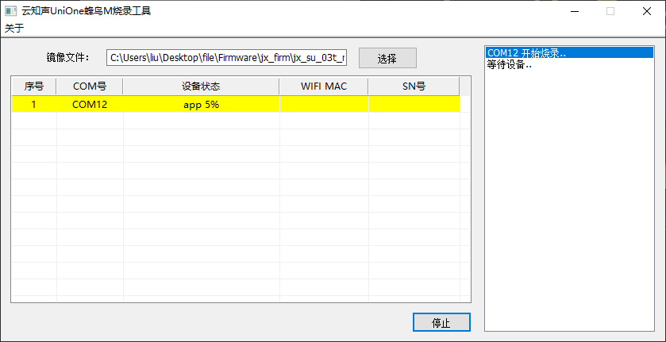
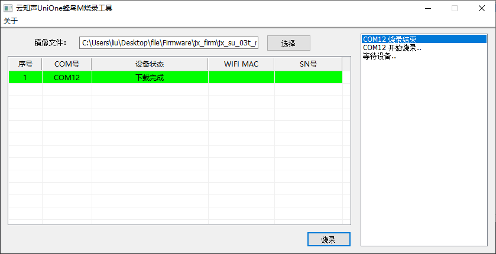

# 3.3.1 小智语音控制基础教程

## 3.3.1.1 语音控制简介

使用小智语音控制模块，烧录我们自定义的小智固件，通过唤醒词"小智小智"唤醒语音控制模块并使用命令词进行控制它通过串口发送指令给UNO开发板。

## 3.3.1.2 语音控制所需模块

| 名称                     | 数量 | 图片                          |
| ------------------------ | ---- | ----------------------------- |
| 小智语音模块             | 1    |  |
| 4P 双头XH2.54插头 连接线 | 1    |          |
| Type-C USB线             | 1    |        |

## 3.3.1.3 规格参数

- 工作电压：3.3V~5.5V
- 供电及待机：500MA/60MA
- 硬件: 1路uart/1路type-c接口
- 音频输出：1路MONO功放输出接口
- FLASH: 2M
- 喇叭功率：8欧1W
- 支持语言：默认固件支持中文（也可自行生成英文）
- 语音指令：70条（最大支持150条）
- 工作温度：0~80℃   

## 3.3.1.4 语音固件烧录教程

### A. 烧录方法：

① 我们打开下载的资料文件，选择烧录工具文件然后找到 UniOneUpdateTool.exe文件鼠标双击打开。

② 打开软件后点击`镜像文件：`后方的`选择`选择下载好的文件`file`-->`Firmware`-->`jx_firm`-->`jx_su_03t_release_update.bin`文件点击打开。

注意：固件存放路径中不能有中文否则将不能烧录！！！！！

③ 选好固件后将语音模块Type-c 旁边的开关从`ON`拨到`1`，再使用数据线将语音模块连接到电脑

④ 连接到电脑后，我们可以可以看到一个COM端口，此时我们点击`烧录`按钮，然后将Type-c旁边的开关从`1`拨到`ON`就能看到下载进度了，等待下载结束即可。

### B. 固件命令表

**语音识别指令：**

命令码：收到命令词后语音模块通过串口输出的命令字符，通过这个命令字符就能判断需要执行什么功能

命令词：人对着语音模块说话的词语，如：“开灯” 就是在告诉语音模块我需要开灯，他就会发送指定的命令码到开发板中开发板通过对指令码进行判断从而实现控制LED灯、舵机、风扇等...

命令回复：告诉你，你的命令已经执行完毕。注意：当需要读取传感器数据的时候如果他回复你“正在读取xx值，就是对于的传感器没接好或者代码不正确。”

| 命令码 |             命令词             |     命令回复     |
| :----: | :----------------------------: | :--------------: |
|   1    | 开红灯，打开红色灯，打开楼道灯 |      已打开      |
|   2    | 关红灯，关闭红色灯，关闭楼道灯 |      已关闭      |
|   3    |    开白灯，开灯，打开客厅灯    |      已打开      |
|   4    |    关白灯，关灯，关闭客厅灯    |      已关闭      |
|   5    | 开绿灯，打开绿色灯，打开厨房灯 |      已打开      |
|   6    | 关绿灯，关闭绿色灯，关闭厨房灯 |      已关闭      |
|   7    | 开蓝灯，打开蓝色灯，打开卧室灯 |      已打开      |
|   8    | 关蓝灯，关闭蓝色灯，关闭卧室灯 |      已关闭      |
|   9    |       发射激光，打开激光       |      已打开      |
|   10   |     停止发射激光，关闭激光     |      已关闭      |
|   11   |           打开继电器           |   继电器已打开   |
|   12   |           关闭继电器           |   继电器已关闭   |
|   13   |            播放音乐            |    音乐已播放    |
|   14   |            停止播放            |    音乐已停止    |
|   15   |         打开水泵，浇水         |      已打开      |
|   16   |       关闭水泵，停止浇水       |      已关闭      |
|   17   |         打开舵机，开窗         |      已打开      |
|   18   |         关闭舵机，关窗         |      已关闭      |
|   19   |            打开风扇            |    风扇已打开    |
|   20   |     风扇调到一档，风扇一档     |  风扇已调到一档  |
|   21   |     风扇调到二档，风扇二档     |  风扇已调到二档  |
|   22   |     风扇调到三档，风扇三档     |  风扇已调到三档  |
|   23   |            关闭风扇            |    风扇已关闭    |
|   24   |   “播报光敏值” 或 “当前亮度”   |  正在读取光敏值  |
|   25   | “当前温度” 或 “现在温度是多少” | 正在读取环境温度 |
|   26   | “当前湿度” 或 “现在湿度是多少” | 正在读取环境湿度 |
|   27   |      “测距” 或 “距离多远”      |   正在测量距离   |
|   28   |           “烟雾感应”           |  正在读取烟雾值  |
|   29   |           “酒精感应”           |  正在读取酒精值  |
|   30   |  “当前土壤湿度” 或 “土壤湿度”  | 正在读取土壤湿度 |
|   31   |    “几点了” 或 “现在是几点”    |   正在读取时间   |
|   无   |   “声音大一点” 或 “增大音量”   |    已增大音量    |
|   无   |   “声音小一点” 或 “减小音量”   |    已减小音量    |
|   无   |            最大音量            |  音量已调到最大  |
|   无   |            中等音量            |  音量已调到中等  |
|   无   |            最小音量            |  音量已调到最小  |

**语音播报指令：**

消息号：消息号是UNO通过串口发送给语音模块的指令，语音模块接收到消息号后就会播报对应的语音

语音播报：收到消息号后播报的语音，双引号“xxxx”中的是数据的名称，如：当前亮度为百分之“二十”，当前温度是"二十六"摄氏度

注意：如果是超过255的数值将需要将数值转换成百分比后再发送给语音模块，因为语音模块最大能播报255！！！

| 消息号 |                 播报指令                 |
| :----: | :--------------------------------------: |
|   1    |     当前亮度为百分之 “光敏值百分比”      |
|   2    |        当前温度是 “温度值” 摄氏度        |
|   3    |        当前湿度是百分之 “湿度值”         |
|   4    |         当前距离是 “距离值” 厘米         |
|   5    |   当前烟雾浓度为百分比 “烟雾值百分比”    |
|   6    |   当前酒精浓度为百分之 “酒精值百分比”    |
|   7    |   当前土壤湿度是百分之 “湿度值百分比”    |
|   8    |               警告受到撞击               |
|   9    | 警告温度过高，当前温度为 “温度值” 摄氏度 |
|   10   |               警告发生倾斜               |
|   11   |       警告，检测到烟雾，请快速撤离       |
|   12   |      警告，“距离值” 厘米后发生碰撞       |
|   13   |              警告，酒精泄露              |
|   14   |        警告，非法闯入，请立即离开        |
|   15   |       警告，发生震动，请前往空旷地       |
|   16   |             下雨了，快收衣服             |
|   17   |    请注意花盆土壤湿度过低，请尽快浇水    |
|   18   |      现在是 “时钟值” 点 “分钟值” 分      |

## 3.3.1.5 自定义语音固件教程

如果你想更深入的了解语音模块，你可以访问这个语音模块的单独教程，里面有语音模块更详细的介绍以及如何自定义语音模块固件。

[小智中文语音模块 — keyestudio WiKi 文档](https://www.keyesrobot.cn/projects/KE4084/zh-cn/latest/docs/KE4084%20KE3101%20KE3102%20%E5%B0%8F%E6%99%BA%E4%B8%AD%E6%96%87%E8%AF%AD%E9%9F%B3%E6%A8%A1%E5%9D%97.html#ke4084-ke3101-ke3102)

