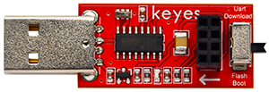

# **产品概述**

# 1.1 简介

**WIFI控制+语音控制扩展包**是专为UNO开发板设计的增强功能模块。添加该扩展包后，您可通过WiFi远程控制连接在UNO开发板上的LED等设备，并实时读取板载传感器数据，同步显示至控制终端。语音控制功能支持自定义唤醒词（例如“小智小智”），可通过语音指令实现开关灯等操作。本扩展包配套课程，专门适配KE3001、KE3002、KE3003三款传感器套件，提供针对性的教学与实践指导。

# 1.2 清单

| 序号 | 名称                                                         | 数量 | 图片                                                         |
| ---- | ------------------------------------------------------------ | ---- | ------------------------------------------------------------ |
| 1    | Keyes STEM电子积木 SU03小智中文语音模块                      | 1    |                                 |
| 2    | keyes brick ESP-01S Arduino wifi转串口扩展板(焊盘孔) 防反插白色端子 | 1    |                                 |
| 3    | Keyes USB转ESP-01S WIFI模块串口测试扩展板                    | 1    |                                 |
| 4    | ESP-01S模块                                                  | 1    |                                 |
| 5    | 4P 双头XH2.54插头 L=200mm 白色                               | 1    |  |
| 6    | 4P 双头XH2.54插头 VCC-GND反向                                | 1    |                                     |
| 7    | Type-C USB线                                                 | 1    |                                      |

# 1.3 模块介绍

### 1.3.1 语音模块介绍

小智语音模块，使用MUS516P6为主控芯片，是一款低功耗、小体积、功能强大的离线语音识别模组，能快速应用于智能家居，各类智能小家电，86 盒，玩具，灯具等需要语音操控的产品。

### 1.3.2 WiFi转串口扩展板介绍

这是一个适用于ESP-01S WiFi模块的扩展板，方便没有为ESP-01S模块没有预留接口的开发板进行连接。

### 1.3.3 USB转ESP-01S WiFi模块串口测试扩展板介绍

这是一个专门为ESP-01S WiFi模块下载代码的串口转接模块，只需要将ESP-01S WiFi模块插入即可连接到电脑上进行下来代码到ESP-01S中。

### 1.3.4 ESP-01S WiFi模块介绍

**ESP-01S WiFi模块**是一款高性能、高集成度的无线网络通信模块，专为物联网（IoT）与嵌入式设备设计。基于乐鑫ESP8266芯片打造，它兼具紧凑的尺寸与出色的无线连接能力，可轻松为各类电子项目赋予Wi-Fi联网功能。

